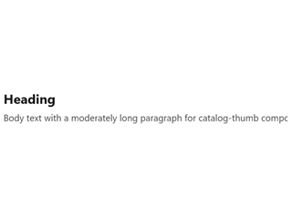
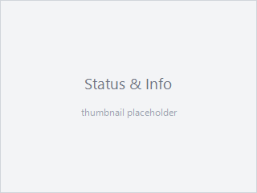
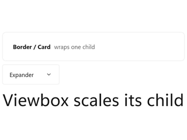
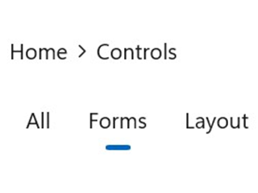
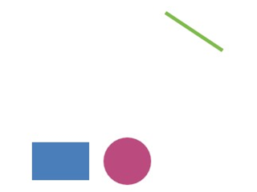
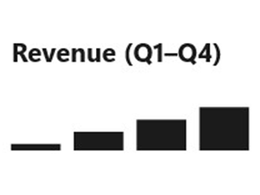

# Controls

```csharp
class ControlsCatalogApp : Component
{
    public override Element Render() => VStack(8,
        TextBlock("Controls catalog").FontSize(20).Bold(),
        TextBlock("Every Reactor control, grouped by category.").Opacity(0.7),
        Button("Open Forms", () => { })
    ).Padding(16);
}
```

Every visible thing on screen is a control. In Microsoft.UI.Reactor (Reactor) a control is the
return value of a factory like `TextBlock(...)` or `Button(...)` — a
plain element you compose, chain modifiers onto, and return from
`Render()`. The ten categories below cover the full set Reactor
exposes today. Pick a category, open its detail page, and you'll find
the factory signature, modifier matrix, and screenshots for every
control inside it.

Two ground rules apply across the catalog:

1. **Every control has a Reactor factory.** No XAML in `Render()` — the
   factories on [`Microsoft.UI.Reactor.Factories`](hooks.md) are the
   only thing you need to compose UI.
2. **WinUI-wrapper controls link out, not duplicate.** When a control
   (like `DatePicker` or `AutoSuggestBox`) is a transparent WinUI
   wrapper, the Reactor page covers the factory and modifier surface
   and links to the Microsoft Learn design page for theming, layout
   guidance, and accessibility behavior. Reactor-original controls
   (`DataGrid`, `Markdown`, `VirtualList`, `FlexPanel`) are
   documented exhaustively in their own pages.

<!-- ai:lock -->
**What "every control" means here, precisely.** The tables below are the
mountable control catalog: every element type registered with the
`ControlRegistry` by
[`ReactorApp.RegisterAllBuiltIns()`](extending-reactor-controls.md),
minus nine framework elements that are plumbing rather than something you
pick off a shelf. `CommandHost` and `NavigationHost` are wiring emitted by
[commanding](commanding.md) and [navigation](navigation.md); `FormField`,
`ValidationRule`, and `ValidationVisualizer` are the
[forms](forms.md) validation decorators; `Semantic` is the
[accessibility](accessibility.md) annotation wrapper; `XamlHost` and
`XamlPage` are the [XAML interop](xaml-developers.md) hosts; and
`AnnounceRegion` is internal — it exists only to back the
[`UseAnnounce`](accessibility.md) hook and has no public factory. A unit
test (`ControlCatalogCompletenessTests`) fails the build when a newly
registered control is missing from this page, so the claim above is
checked rather than asserted.
<!-- /ai:lock -->

## Categories

| Category | What's in it | Detail page |
|---|---|---|
| Forms | Text input, picker, button, validation primitives | [Forms](forms.md) |
| Collections | List, grid, virtualized list, repeater | [Collections](collections.md) |
| Text & Media | Heading, rich text, image, media player | [Text & Media](text-and-media.md) |
| Status & Info | Progress, info bar, badge, teaching tip | [Status & Info](status-and-info.md) |
| Layout & Containers | Stacks, grids, borders, scroll hosts, panes | [Layout](layout.md) |
| Navigation | Nav view, frame, tabs, breadcrumb, pivot | [Navigation](navigation.md) |
| Shapes & Icons | Rectangle, ellipse, line, path, icon sources | [Styling](styling.md) |
| Dialogs & Flyouts | Content dialog, menu flyout, command bar flyout | [Dialogs & Flyouts](dialogs-and-flyouts.md) |
| Data System | DataGrid, columns, data sources, paging | [Data System](data-system.md) |
| Charting | Line, bar, area, pie, force graph | [Charting](charting.md) |

## Forms

Text input, choice, sliders, buttons, and the validation pipeline.
Forms is the category most apps spend time in; the detail page
([forms.md](forms.md)) covers controlled-input patterns and the
`FormField` validation surface.

```csharp
class FormsGroup : Component
{
    public override Element Render()
    {
        var (name, setName) = UseState("Ada");
        var (agree, setAgree) = UseState(true);
        var (volume, setVolume) = UseState(60.0);

        return VStack(8,
            TextBox(name, setName, placeholderText: "Name").Width(200),
            CheckBox(agree, setAgree, label: "I agree"),
            Slider(volume, 0, 100, setVolume).Width(200),
            Button("Submit", () => { })
        ).Padding(16);
    }
}
```


| Control | Description |
|---|---|
| `TextBox` | Single-line text input with placeholder + header. |
| `PasswordBox` | Obscured text input. |
| `NumberBox` | Numeric input with up/down spinner. |
| `AutoSuggestBox` | Text input with a filtered suggestion list. |
| `CheckBox` / `ThreeStateCheckBox` | Two- or three-state checkbox with optional label. |
| `ToggleSwitch` | Two-state switch with optional header. |
| `Slider` | Min/max-bounded numeric value. |
| `ComboBox` | Drop-down list of strings. |
| `RadioButtons` | Single-select radio group. |
| `RadioButton` | A single radio, for hand-built groups. |
| `DatePicker` | Inline three-spinner date picker (non-null). |
| `CalendarDatePicker` | Compact button that opens a popup calendar (nullable). |
| `CalendarView` | Full month grid with single / multiple / range selection. |
| `TimePicker` | Hour / minute / period spinner. |
| `ColorPicker` | Continuous color selection with spectrum and hex input. |
| `Button` | Click handler with label. |
| `RepeatButton` | Fires repeatedly while held. |
| `ToggleButton` / `ThreeStateToggleButton` | Button that latches a state. |
| `HyperlinkButton` | Link-styled button with a navigate target. |
| `DropDownButton` | Button that opens an attached flyout. |
| `SplitButton` / `ToggleSplitButton` | Primary action plus a drop-down half. |

WinUI design page: [Buttons](https://learn.microsoft.com/en-us/windows/apps/design/controls/buttons),
[Text controls](https://learn.microsoft.com/en-us/windows/apps/design/controls/text-controls).

## Collections

Bound-list rendering and virtualization. Use `ListView` when the data
fits in memory and the row template is uniform, `VirtualList` when the
list is large enough that mounting all rows would hurt frame time, and
`LazyVStack` when the layout must be a stack but mounting cost is the
bottleneck.

```csharp
class CollectionsGroup : Component
{
    public override Element Render()
    {
        var items = new[] { "Alpha", "Bravo", "Charlie", "Delta" };
        return VStack(4,
            TextBlock("Items").Bold(),
            ForEach(items, item => TextBlock($"  • {item}"))
        ).Padding(16);
    }
}
```


| Control | Description |
|---|---|
| `ListView<T>` | Bound, keyed list with per-item view builder. |
| `GridView<T>` | Tiled bound collection. |
| `ListBox` | Compact non-virtualizing selection list. |
| `LazyVStack<T>` / `LazyHStack<T>` | Defer-mounted vertical / horizontal stack. |
| `VirtualList` | Index-driven virtual list with scroll API. |
| `ItemsRepeater<T>` | Bare virtualizing panel — no chrome, no selection. |
| `ItemsView<T>` | Modern items host with typed selection. |
| `ItemContainer` | Selection / hover chrome for a hand-built item host. |
| `TreeView<T>` | Hierarchical list with expand / collapse. |
| `ForEach` | Compose a sequence of elements without a list control. |

Detail page: [Collections](collections.md).

## Text & Media

Read-only display surfaces: headings, body text, formatted text,
images, video. Most are transparent WinUI wrappers; the
Reactor-original here is `Markdown(string)`, which renders Markdown
without round-tripping through a WebView.

```csharp
class TextAndMediaGroup : Component
{
    public override Element Render() => VStack(6,
        TextBlock("Heading").FontSize(20).Bold(),
        TextBlock("Body text with a moderately long paragraph " +
                  "for catalog-thumb composition.").Opacity(0.8)
    ).Padding(16);
}
```



| Control | Description |
|---|---|
| `TextBlock` | Single-line or wrapping text. |
| `Title` / `Heading` / `SubHeading` / `Subtitle` | Semantic heading sizes. |
| `Body` / `BodyLarge` / `BodyStrong` / `Caption` | Semantic body and metadata sizes. |
| `RichTextBlock` | Inline-formatted text. |
| `RichEditBox` | Editable rich text. |
| `Markdown` | Reactor-original Markdown renderer (`Microsoft.UI.Reactor.Advanced`). |
| `Image` | Bitmap source. |
| `MediaPlayerElement` | Video / audio playback. |
| `WebView2` | Embedded Chromium surface. |
| `MapControl` | Bing-Maps-backed map surface. |
| `InkCanvas` | Pen input. **Not wrapped** — see [gap analysis](https://github.com/microsoft/microsoft-ui-reactor/blob/main/docs/specs/002-winui3-gap-analysis.md). |

Detail page: [Text & Media](text-and-media.md).

## Status & Info

Non-interactive feedback: progress, badges, info bars, teaching tips.
Use these to inform without stealing focus — for blocking confirmation
you want [Dialogs & Flyouts](dialogs-and-flyouts.md) instead.

```csharp
class StatusGroup : Component
{
    public override Element Render() => VStack(8,
        TextBlock("Saving…").Bold(),
        TextBlock("3 of 12 items").Opacity(0.7)
    ).Padding(16);
}
```



| Control | Description |
|---|---|
| `Progress` / `ProgressIndeterminate` | Linear determinate / indeterminate progress. |
| `ProgressRing` | Spinner for indeterminate work. |
| `InfoBar` | Inline app-state message. |
| `InfoBadge` | Notification count badge. |
| `TeachingTip` | One-shot guided callout. |
| `PipsPager` | Compact paginator dots. |
| `PersonPicture` | Contact avatar. |
| `RatingControl` | 0–5 star rating. |

Detail page: [Status & Info](status-and-info.md).

## Layout & Containers

Panels that position children, and single-child hosts that add chrome,
scrolling, or clipping. These are the structural half of the catalog —
they rarely appear on their own, but every screen is made of them.

```csharp
class LayoutGroup : Component
{
    public override Element Render() => VStack(8,
        Card(
            HStack(8,
                TextBlock("Border / Card").Bold(),
                TextBlock("wraps one child").Opacity(0.7)
            ).Padding(8)
        ),
        Expander("Expander", TextBlock("Collapsible section body.")),
        Viewbox(TextBlock("Viewbox scales its child").FontSize(10))
    ).Padding(16);
}
```



| Control | Description |
|---|---|
| `VStack` / `HStack` | Spaced linear stacks — the default panel. |
| `Grid` / `UniformGrid` / `InterspersedGrid` | Row / column grid layout. |
| `FlexRow` / `FlexColumn` | CSS-Flexbox layout via Yoga ([flex-layout](flex-layout.md)). |
| `WrapGrid` | Items flow and wrap to the next line. |
| `RelativePanel` | Constraint-based sibling positioning. |
| `Canvas` | Absolute X/Y positioning. |
| `Border` / `Card` | Single-child chrome: background, corner radius, stroke. |
| `Viewbox` | Uniformly scales one child to fit. |
| `ScrollView` / `ScrollViewer` | Scroll hosts (modern / classic). |
| `AnnotatedScrollBar` | Scroll bar with labelled tick marks. |
| `SplitView` | Collapsible side pane plus content. |
| `Expander` | Collapsible header + content section. |
| `RefreshContainer` | Pull-to-refresh wrapper. |
| `SwipeControl` | Swipe-revealed commands on an item. |
| `SemanticZoom` | Paired zoomed-in / zoomed-out views. |
| `ParallaxView` | Background that scrolls at an offset rate. |

Detail page: [Layout](layout.md); flex specifics in [Flex Layout](flex-layout.md).

## Navigation

Controls that move the user between screens or sections. Pair them with
the routing hooks on [navigation.md](navigation.md) — the control is the
chrome, the navigation state is a hook.

```csharp
class NavigationGroup : Component
{
    public override Element Render()
    {
        var (tab, setTab) = UseState(1);

        return VStack(8,
            BreadcrumbBar([
                new BreadcrumbBarItemData("Home"),
                new BreadcrumbBarItemData("Controls"),
            ]),
            SelectorBar([
                new SelectorBarItemData("All"),
                new SelectorBarItemData("Forms"),
                new SelectorBarItemData("Layout"),
            ], tab, setTab)
        ).Padding(16);
    }
}
```



| Control | Description |
|---|---|
| `NavigationView` | Top or left app navigation shell. |
| `Frame` | Page host with back-stack integration. |
| `BreadcrumbBar` | Ancestor trail with click-to-jump. |
| `TabView` | Closable, reorderable document tabs. |
| `Pivot` | Swipeable top-level section switcher. |
| `SelectorBar` | Compact inline segment picker. |
| `FlipView` | One-item-at-a-time paged view. |
| `TitleBar` | Custom window title bar content. |

Detail page: [Navigation](navigation.md); window chrome in [Windows](windows.md).

## Shapes & Icons

Vector primitives and icon sources. Shapes take a `Brush` for `Fill` /
`Stroke` (not the color string that panel-level `.Background(...)`
accepts). For imperative 2D drawing, see [Win2D canvas](win2d-canvas.md).

```csharp
class ShapesGroup : Component
{
    // Shape fills/strokes take a WinUI Brush (not a color string like the
    // panel-level .Background(string) modifier).
    static SolidColorBrush Swatch(byte r, byte g, byte b) =>
        new(Color.FromArgb(255, r, g, b));

    public override Element Render() => HStack(12,
        Rectangle().Width(48).Height(32).Fill(Swatch(0x4a, 0x7e, 0xbb)),
        Ellipse().Width(40).Height(40).Fill(Swatch(0xbb, 0x4a, 0x7e)),
        Line(0, 0, 48, 32).Stroke(Swatch(0x7e, 0xbb, 0x4a)).StrokeThickness(3)
    ).Padding(16);
}
```



| Control | Description |
|---|---|
| `Rectangle` | Rectangle with optional corner radii. |
| `Ellipse` | Ellipse / circle. |
| `Line` | Straight segment between two points. |
| `Path2D` | Arbitrary geometry from path data. |
| `Icon` | Polymorphic icon source (font glyph, symbol, bitmap, path). |
| `AnimatedIcon` | Icon that plays a transition between states. |
| `AnimatedVisualPlayer` | Lottie / composition animation host. |

Detail pages: [Styling](styling.md), [Animation](animation.md).

## Dialogs & Flyouts

Modal and ephemeral surfaces. Reactor wires these through the
[commanding](commanding.md) system so the same `Command<T>` can light
up a button, a menu item, and a keyboard shortcut without duplicating
logic.

```csharp
class DialogsGroup : Component
{
    public override Element Render() => VStack(8,
        TextBlock("Confirm action").Bold(),
        TextBlock("This cannot be undone.").Opacity(0.8),
        HStack(8,
            Button("Cancel", () => { }),
            Button("Delete", () => { })
        )
    ).Padding(16);
}
```


| Control | Description |
|---|---|
| `ContentDialog` | Modal full-screen confirmation. |
| `Flyout` | Lightweight anchored surface with arbitrary content. |
| `MenuFlyout` | Context menu attached to a target. |
| `CommandBarFlyout` | Mini-toolbar with commands. |
| `CommandBar` | Persistent primary / secondary command strip. |
| `MenuBar` | Classic top-level menu bar. |
| `Popup` | Free-form anchored surface. |

Detail page: [Dialogs & Flyouts](dialogs-and-flyouts.md).

## Data System

`DataGrid` and the data-source / column / paging primitives. The
data-system surface is Reactor-original (no WinUI parallel) and is
documented exhaustively in [data-system.md](data-system.md).

```csharp
class DataSystemGroup : Component
{
    public override Element Render()
    {
        var rows = new[] { ("Ada", 36), ("Linus", 55), ("Grace", 85) };
        return VStack(4,
            HStack(16,
                TextBlock("Name").Bold(),
                TextBlock("Age").Bold()
            ),
            ForEach(rows, r => HStack(16,
                TextBlock(r.Item1),
                TextBlock(r.Item2.ToString())
            ))
        ).Padding(16);
    }
}
```


| Control / Type | Description |
|---|---|
| `DataGrid<T>` | Virtualized grid with sort / filter / inline edit. |
| `Column<T>` | Column descriptor + builder. |
| `IDataSource<T>` | Pluggable data source abstraction. |
| `ListDataSource<T>` | In-memory source with client-side sort/filter. |
| `DataPageCache<T>` | Incremental paging cache. |

Detail page: [Data System](data-system.md).

## Charting

`ReactorCharting` package — chart primitives that compose like any
other element. Bring the charts into scope with
`using static Microsoft.UI.Reactor.Charting.Charts;`.

```csharp
class ChartingGroup : Component
{
    public override Element Render() => VStack(8,
        TextBlock("Revenue (Q1–Q4)").Bold(),
        // Placeholder visual — the real charting category uses ReactorCharting.
        TextBlock("▁ ▃ ▅ ▇").FontSize(28)
    ).Padding(16);
}
```



| Control | Description |
|---|---|
| `LineChart<T>` | Line series with axes. |
| `BarChart<T>` | Bar / column series. |
| `AreaChart<T>` | Filled area under a line. |
| `PieChart<T>` | Categorical share. |
| `TreeChart<T>` | Hierarchical layout. |
| `ForceGraph` | Force-directed node graph. |

Detail page: [Charting](charting.md).

## Tips

**Don't reach for a custom Component before checking the catalog.**
Most needs are met by composing existing factories — a "card" is a
`VStack` inside a `Border`, a "stat tile" is two `TextBlock`s stacked.
The cost of a custom Component is the cost of maintaining its render
function forever.

**Reactor-original vs. WinUI wrapper matters for documentation.**
Wrappers point to Microsoft Learn for design guidance; Reactor-originals
own their full surface here. When the per-control page is missing a
section like "accessibility behavior", check whether the control is a
wrapper — the answer is usually upstream.

**Catalog thumbnails are not micro-tutorials.** They show the control
in a representative state, no more. The detail page covers usage,
modifiers, and the "Don't" cases.

## Next Steps

- **[Components](components.md)** — Previous: how a `Component` is the
  thing that hosts a tree of controls.
- **[Forms](forms.md)** — Next: the biggest catalog category, with the
  full input + validation surface.
- **[Layout](layout.md)** — How `VStack` / `HStack` / `Grid` /
  `FlexPanel` compose any control into a real screen.
- **[Styling](styling.md)** — `ThemeRef` tokens, modifier chaining, and
  named styles applied across the catalog.
- **[Recipes](recipes/index.md)** — Real-world compositions that pull
  controls together into common shapes.
