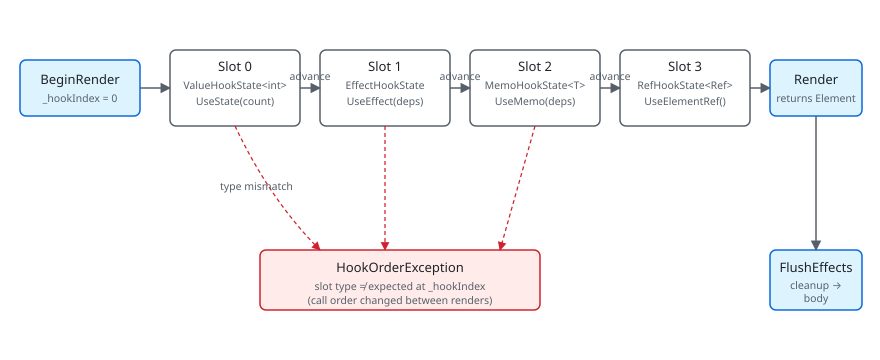

A hook in Microsoft.UI.Reactor (Reactor) is a position. When `Render()` runs, the framework
counts each hook call in order — `UseState` is slot 0, then `UseEffect`
is slot 1, then `UseMemo` is slot 2 — and stores whatever each hook
needs in a `List<HookState>` on the owning `RenderContext`. The next
render starts from `_hookIndex = 0` again and walks the same list in
the same order. The slot at position 0 had better still be the one
`UseState` expects to find there, because the setter delegate
`UseState` returned on the first render is cached on that slot cell
and writes back to the same cell when you call it. This is the entire
mechanical foundation of every hook rule you've ever read: "same hooks
in the same order every render" is the runtime invariant the slot
table enforces. Get it wrong — a conditional `UseState` inside an
`if`, a hook inside a loop whose iteration count changed — and the
type check on the slot throws `HookOrderException` because the slot
that used to hold `ValueHookState<int>` now sees a `EffectHookState`
asking for its bucket.

# Hooks Internals

This page absorbs the legacy `docs/reference/state-and-hooks.md` and
sits underneath the surface-level [Hooks](hooks.md) reference. The
goal is one description of the storage shape behind every hook —
enough to debug a `HookOrderException`, predict whether `UseState`
returns a stable setter, and know when reaching for `UseRef` is
correct.

## The slot table



| Slot type | Holds | Created by |
|---|---|---|
| `ValueHookState<T>` | Value, optional lock, cached setter delegate | `UseState`, `UseReducer` |
| `ValueHookState<Ref<T>>` | A `Ref<T>` cell in the value slot | `UseRef` |
| `EffectHookState` | Deps, body, cleanup, pending flag | `UseEffect` |
| `MemoHookState<T>` | Deps, cached value | `UseMemo`, `UseCallback`, `UseElementRef` |
| `ContextHookState` | The `ContextBase` read, plus the last value observed | `UseContext` |
| `ResourceHookState<T>` | Cache, cache key, last deps, in-flight CTS, last `AsyncValue<T>` | `UseResource` |
| `PersistedHookState<T>` | Value, persist key, resolved storage scope | `UsePersisted` |

Each subsection below covers one row of that table and the contract
its hook surface depends on.

## RenderContext owns the table

```csharp
public (T Value, Action<T> Set) UseState<T>(T initialValue, bool threadSafe = false)
{
    if (_hookIndex >= _hooks.Count)
    {
        _hooks.Add(new ValueHookState<T>(initialValue, threadSafe));
    }

    var currentIndex = _hookIndex;
    _hookIndex++;

    if (_hooks[currentIndex] is not ValueHookState<T> hook)
        throw new HookOrderException(
            $"Hook at index {currentIndex} is {_hooks[currentIndex].GetType().Name}, expected ValueHookState<{typeof(T).Name}> (UseState). " +
            "Hooks must be called in the same order every render.");
```

`RenderContext` holds the `List<HookState> _hooks` and an `int
_hookIndex`. `BeginRender(requestRerender)` sets `_hookIndex = 0` and
captures the UI thread ID; the component's `Render()` runs, hooks
advance `_hookIndex` as they go, and after `Render()` returns the
reconciler reads `_hooks` to know which effects to flush. There is
one `RenderContext` per `Component` instance (and one per
`RenderEachTime(ctx => …)` function-component invocation — a function component gets its
own context, created at mount and preserved across the parent's re-renders
via positional matching, just like any other
element).

The slot-type check at the top of each hook is the runtime guard:

```csharp
public (T Value, Action<T> Set) UseState<T>(T initialValue, bool threadSafe = false)
{
    if (_hookIndex >= _hooks.Count)
    {
        _hooks.Add(new ValueHookState<T>(initialValue, threadSafe));
    }

    var currentIndex = _hookIndex;
    _hookIndex++;

    if (_hooks[currentIndex] is not ValueHookState<T> hook)
        throw new HookOrderException(
            $"Hook at index {currentIndex} is {_hooks[currentIndex].GetType().Name}, expected ValueHookState<{typeof(T).Name}> (UseState). " +
            "Hooks must be called in the same order every render.");
```

That check is the reason hook rules exist. A conditional hook
(`if (cond) UseState(...)`) advances the slot table on some renders
but not others, so a later hook in the same `Render()` reads a slot
holding a different state type, and the cast fails. The
[REACTOR_HOOKS_001..007](rules-of-reactor.md) analyzer family flags
the most common shapes at build time so the runtime check stays an
assertion of last resort.

## UseState — the canonical slot

```csharp
public (T Value, Action<T> Set) UseState<T>(T initialValue, bool threadSafe = false)
{
    if (_hookIndex >= _hooks.Count)
    {
        _hooks.Add(new ValueHookState<T>(initialValue, threadSafe));
    }

    var currentIndex = _hookIndex;
    _hookIndex++;

    if (_hooks[currentIndex] is not ValueHookState<T> hook)
        throw new HookOrderException(
            $"Hook at index {currentIndex} is {_hooks[currentIndex].GetType().Name}, expected ValueHookState<{typeof(T).Name}> (UseState). " +
            "Hooks must be called in the same order every render.");
```

`UseState` allocates a `ValueHookState<T>` on first render (`_hookIndex
>= _hooks.Count` means "this slot doesn't exist yet"), captures
`currentIndex = _hookIndex`, increments, and type-checks the slot. The
returned setter is *not* rebuilt per render: `MakeStateSetter(hook)`
runs once and the delegate is cached on the slot itself
(`ValueHookState<T>.Setter`, tagged with a `SetterKind` discriminator so
`UseState` and `UseReducer` can't reuse each other's coincidentally
same-typed delegate). That cache is why setter identity is stable across
renders — the closure is allocated once, not because an index happens to
stay constant.

```csharp
private Action<T> MakeStateSetter<T>(ValueHookState<T> h)
{
    void Setter(T newValue)
    {
        bool changed;
        if (h.ThreadSafe)
        {
            lock (h.Lock!)
            {
                changed = !EqualityComparer<T>.Default.Equals(h.Value, newValue);
                if (changed) h.Value = newValue;
            }
            if (Diagnostics.ReactorEventSource.Log.IsEnabled(
                    global::System.Diagnostics.Tracing.EventLevel.Verbose,
                    Diagnostics.ReactorEventSource.Keywords.State))
                Diagnostics.ReactorEventSource.Log.StateChange("UseState", typeof(T).Name, changed);
            if (changed) _requestRerender?.Invoke();
        }
        else
        {
            if (MarshalIfOffUIThread("UseState", () => Setter(newValue))) return;
            changed = !EqualityComparer<T>.Default.Equals(h.Value, newValue);
            if (changed) h.Value = newValue;
            if (Diagnostics.ReactorEventSource.Log.IsEnabled(
                    global::System.Diagnostics.Tracing.EventLevel.Verbose,
                    Diagnostics.ReactorEventSource.Keywords.State))
                Diagnostics.ReactorEventSource.Log.StateChange("UseState", typeof(T).Name, changed);
            if (changed) _requestRerender?.Invoke();
        }
    }
    return Setter;
}
```

The setter is also where the auto-marshal, the equality check, and
the rerender request live. Note what the local function closes over: the
`ValueHookState<T>` *cell*, not the hook index. Once built, the setter
reaches its storage directly and never consults `_hooks` again. Calling
it on a background thread takes the `MarshalIfOffUIThread` branch and
re-enqueues the setter on the UI dispatcher; calling it from the UI
thread runs the body inline. (The `threadSafe: true` flavour skips the
marshal entirely and takes the slot's lock instead.) Either way, the
slot is written with the new value, an ETW
`StateChange` event fires if state-keyword tracing is enabled, and
`_requestRerender` triggers the host to render again on the next
dispatcher tick. The reactivity contract — equality short-circuit,
single signal — is described end-to-end on the [Reactivity
Model](reactivity-model.md) page; the implementation lives here.

> **Caveat:** Because the setter holds the hook cell directly, it keeps writing the
> *same* cell forever — but the slot table still has to hand back that
> cell at the same index on every render. Insert a hook *before* this one
> and every subsequent slot shifts: the next render's type check reads a
> slot holding a different `HookState` subclass and throws
> `HookOrderException`. There's no recovery path; the component has to be
> unmounted (or the source fixed and hot-reload triggered, which migrates
> the surviving cells and remounts).

## UseEffect — the slot that runs later

```csharp
public void UseEffect(Action effect, params object[] dependencies)
{
    var hook = AcquireEffectSlot();
    // Snapshot the deps on store (SnapshotDeps): a caller can pass — and then
    // reuse and mutate in place — the same array instance across renders, so the
    // stored copy must be isolated or DepsEqual would alias prev/next and skip a
    // real change (Issue #659 review #3). Only the deps-CHANGED path stores, so
    // this adds no steady-state allocation.
    if (hook.Dependencies is null || !DepsEqual(hook.Dependencies, dependencies))
        ScheduleEffect(hook, effect, null, SnapshotDeps(dependencies));
}
```

`UseEffect` doesn't run the body during `Render()`. It allocates an
`EffectHookState` if needed, compares the dependencies against the
previous render's deps (`DepsEqual` uses `object.Equals` element-wise),
and if they differ — or if this is the first render — it stashes the
old cleanup as `PendingCleanup`, replaces the deps and body, and
flips `Pending = true`. The reconciler calls `FlushEffectsTraced`
after commit; flush runs all `PendingCleanup` callbacks first, then
all `Effect` bodies, both in slot order.

The cleanup-before-body ordering is load-bearing: a `cts.Cancel()` /
`timer.Dispose()` cleanup actually disposes the previous timer
before the new body creates a new one. The
[Effects Scheduling](effects-scheduling.md) page covers the timing
contract; this is the slot-shape that implements it.

The reason `UseEffect(body, deps)` returns nothing and the cleanup
mechanism uses a closure-returned `Func<Action>` (the overload
`UseEffect(Func<Action>)`) is to avoid eagerly walking through every
hook's "what if this cleans up" plumbing. Effects that need cleanup
opt in by returning an action; the slot holds a `null` cleanup
otherwise.

## UseMemo — the cached-value slot

```csharp
public static ElementRef<T> UseElementRef<T>(this RenderContext ctx)
    where T : FrameworkElement
{
    if (ctx is null) throw new ArgumentNullException(nameof(ctx));

    // UseMemo with empty deps allocates the typed+inner ref on the first
    // render only; subsequent renders return the cached instance. Using
    // UseState here would eagerly evaluate `new ElementRef<T>(new ElementRef())`
    // on every render and throw the result away (UseState only consults
    // the initial value on first call), which would defeat the point of a
    // cheap stable ref hook.
    return ctx.UseMemo(static () => new ElementRef<T>(new ElementRef()), Array.Empty<object>());
}
```

`UseMemo<T>(factory, deps)` allocates a `MemoHookState<T>` and stores
the computed value plus the deps it was computed against. Subsequent
renders compare deps; on miss, run the factory and store; on hit,
return the cached value. The factory is *not* an effect — it runs
inside `Render()`, on the render path, so it must be pure (no
setters, no side effects).

`UseElementRef` is the canonical example of building a hook out of
`UseMemo` with empty deps. The static lambda `() => new ElementRef<T>(new ElementRef())`
runs on the first render only; every subsequent render returns the
same `ElementRef<T>` instance. Storing the ref in `UseState` would
re-allocate on every render and throw the result away — `UseState`'s
initial value is consulted only on first call, but the allocation
happens unconditionally.

This is the general pattern for custom hooks. Compose existing hooks
inside a regular method; the slot table doesn't care whether the
hook call comes from the component's `Render()` directly or from a
helper called by `Render()`, as long as call order is stable.

## UseRef — the mutable cell

`UseRef<T>(initial)` stores a `Ref<T>` wrapper in an ordinary
`ValueHookState<Ref<T>>` slot — there is no dedicated ref slot type; the
wrapper *is* the mutable cell. It exposes `Current` as a get/set property;
mutating it does *not* schedule a re-render — that's the entire point.
Reach for `UseRef` when you need a value that persists across renders
but the UI doesn't depend on it: a counter you log, a debounce
timer ID, the previous value of a state cell, a stable target for an
external library that wants a long-lived reference.

```csharp
var renderCount = UseRef(0);
renderCount.Current++;              // does NOT re-render

var prev = UseRef("");
UseEffect(() => { prev.Current = name; }, name);
```

If you find yourself wanting `UseRef` to trigger re-renders, you
probably want `UseState` instead. `UseRef`'s value is an escape hatch
for state that shouldn't drive UI.

## UseObservable, UseExternalStore, UseResource, UseContext

```csharp
public sealed class PendingScope
{
    private readonly Dictionary<object, bool> _loadingByToken = new(capacity: 4);
    private readonly object _lock = new();

    /// <summary>Fires when a resource joins, leaves, or changes its loading state.</summary>
    public event Action? Changed;

    /// <summary>
    /// Start tracking <paramref name="token"/> with the given initial <paramref name="isLoading"/>
    /// state. A hook typically uses its own <c>this</c>-equivalent as the token.
    /// </summary>
    public void Register(object token, bool isLoading)
    {
        lock (_lock) _loadingByToken[token] = isLoading;
        Changed?.Invoke();
    }
```

`UseObservable<T>(T source)` subscribes the current component to an
`INotifyPropertyChanged` source and returns *that same instance* back.
It consumes two slots, not one: a `UseReducer(false)` toggle plus a
`UseEffect` keyed on `source` that attaches `PropertyChanged` and flips
the toggle on every notification. Flipping the toggle is what schedules
the re-render; the component then reads the source's properties
directly. Cleanup unsubscribes.

`UseExternalStore<TSnapshot>` follows the same ownership model for non-INPC
stores that expose `subscribe` plus `getSnapshot`. The hook reads the snapshot
during render, keeps the latest getter and comparer in a stable ref-backed cell,
and installs one effect-owned subscription. Each change notification re-reads
the snapshot and only schedules a re-render when the comparer reports a real
change.

`UseResource<T>` walks a fuller slot shape — a `ResourceHookState<T>`
carrying the [`QueryCache`](async-resources.md) it reads from, the cache
key, the deps it was resolved against, the in-flight
`CancellationTokenSource`, the latest `AsyncValue<T>`, and a
registration with the nearest [`PendingScope`](async-resources.md)
ancestor. `UseInfiniteResource` and `UseMutation` have their own
slot types (`InfiniteHookState<TItem, TCursor>`,
`MutationHookState<TInput, TResult>`) in the same category — a thing the
component renders against, with cleanup that releases external state on
unmount. All three are documented end-to-end in the
[async-system reference](https://github.com/microsoft/microsoft-ui-reactor/blob/main/docs/reference/async-system.md).

`UseContext<T>(Context<T> context)` reads the [Context](context.md)
value the nearest ancestor pushed via a `.Provide(context, value)`
modifier, falling back to the context's `DefaultValue` when no ancestor
provides one. The slot (`ContextHookState`) records which context was
read and the last value it saw, so a change to the context value (via
the providing parent's re-render) marks the consuming component dirty.

## Function components

```csharp
public abstract class Component
{
    // Settable so the reconciler can transfer a live RenderContext (hooks +
    // cleanups) onto a freshly-constructed instance when a Hot Reload edit
    // mints a new component Type token (spec 049 §7 subtree migration). Outside
    // that path the value is the per-instance context created here.
    internal RenderContext Context { get; set; } = new();

    /// <summary>
    /// Override to describe the UI. Use UseState, UseEffect, etc. from the context.
    /// Must call hooks in the same order every render.
    /// </summary>
    public abstract Element Render();

    /// <summary>
    /// Controls whether this propless component should re-render when its parent re-renders.
    /// Default: false — propless components only re-render from their own state changes or context changes.
    /// Override and return true to always re-render when the parent re-renders.
    /// </summary>
    protected internal virtual bool ShouldUpdate() => false;
```

`Memo(ctx => Render(ctx))` materializes as a function-component
element. The reconciler treats it like any other component — element
record on the tree, mounted into a slot in the parent — but the
"component instance" is an internal wrapper holding its own
`RenderContext`. The wrapper instance is keyed by position in the
parent's render output (or by `.WithKey(...)` if set), so its hook
state persists across the parent's re-renders the same way a `class
MyComponent : Component` would.

The implication is that hooks called inside the `ctx => ...` lambda
must follow the same rules as hooks in a class component's
`Render()`. The lint and analyzer rules don't distinguish: same call
order, no conditionals, no varying-count loops.

## Patterns

### Building a custom hook

A custom hook is a regular method that calls existing hooks. The
slot table doesn't care; only call order matters. The convention is
the `Use` prefix so the analyzer can apply hook-rules at the call
site:

```csharp
static class DebouncedTextHook
{
    public static (string Value, Action<string> Set) UseDebouncedText(
        this RenderContext ctx, string initial, int ms)
    {
        var (value, setValue) = ctx.UseState(initial);
        var (debounced, setDebounced) = ctx.UseState(initial);

        ctx.UseEffect(() =>
        {
            var cts = new CancellationTokenSource();
            _ = Task.Run(async () =>
            {
                try { await Task.Delay(ms, cts.Token); setDebounced(value); }
                // Expected: the cleanup below cancels this delay whenever `value`
                // changes again inside the debounce window. Cancelling is how the
                // stale result is discarded, so there is nothing to report.
                catch (OperationCanceledException) { return; }
            });
            return () => { cts.Cancel(); };
            // Both captured values are dependencies. `ms` is easy to leave out —
            // it usually comes from a constant at the call site — but omitting it
            // means a caller that changes the delay keeps the already-armed timer
            // running on the old interval until `value` happens to change.
        }, value, ms);

        return (debounced, setValue);
    }
}
```

```csharp
public static ElementRef<T> UseElementRef<T>(this RenderContext ctx)
    where T : FrameworkElement
{
    if (ctx is null) throw new ArgumentNullException(nameof(ctx));

    // UseMemo with empty deps allocates the typed+inner ref on the first
    // render only; subsequent renders return the cached instance. Using
    // UseState here would eagerly evaluate `new ElementRef<T>(new ElementRef())`
    // on every render and throw the result away (UseState only consults
    // the initial value on first call), which would defeat the point of a
    // cheap stable ref hook.
    return ctx.UseMemo(static () => new ElementRef<T>(new ElementRef()), Array.Empty<object>());
}
```

Every call to `UseDebouncedText` consumes three slots
(`UseState`, `UseState`, `UseEffect`). Calling it conditionally
breaks the same way an inline conditional `UseState` would.

### Reading the previous value of a state

`UseRef` plus `UseEffect` gives you the previous render's value:

```csharp
var (count, setCount) = UseState(0);
var prevCount = UseRef(0);
var previous = prevCount.Current;
UseEffect(() => { prevCount.Current = count; }, count);
```

`previous` carries the value `count` had before the most recent
update. The mutation inside the effect doesn't re-render; the next
render reads the new value via the `Ref<T>` cell.

## Common Mistakes

### Conditional hook

```csharp
// Don't:
public override Element Render()
{
    if (showCounter)
    {
        var (count, setCount) = UseState(0);   // slot count varies per render
        return Button($"{count}", () => setCount(count + 1));
    }
    return TextBlock("hidden");
}
```

```csharp
public (T Value, Action<T> Set) UseState<T>(T initialValue, bool threadSafe = false)
{
    if (_hookIndex >= _hooks.Count)
    {
        _hooks.Add(new ValueHookState<T>(initialValue, threadSafe));
    }

    var currentIndex = _hookIndex;
    _hookIndex++;

    if (_hooks[currentIndex] is not ValueHookState<T> hook)
        throw new HookOrderException(
            $"Hook at index {currentIndex} is {_hooks[currentIndex].GetType().Name}, expected ValueHookState<{typeof(T).Name}> (UseState). " +
            "Hooks must be called in the same order every render.");
```

When `showCounter` flips from true to false, slot 0 (which had been
`ValueHookState<int>`) is gone from the slot table on that render —
or rather, the slot-table position 0 is now whatever hook the next
`Render()` happens to call first. The runtime check throws
`HookOrderException` on the first hook whose slot type no longer
matches. Hoist the `UseState` to unconditional, branch on the value
*inside* the returned tree:

```csharp
var (count, setCount) = UseState(0);
return showCounter ? Button($"{count}", () => setCount(count + 1)) : TextBlock("hidden");
```

## Tips

**`HookOrderException` is a structural error.** Read the message,
find the hook whose slot type the runtime saw — that hook's call
site is where the slot table went out of sync. Often the actual
offender is an earlier hook that ran on one render and not on
another; the visible failure is downstream.

**Custom hooks don't need framework cooperation.** Any extension
method on `RenderContext` (or `Component`) that calls existing hooks
is a hook. The `Use` prefix is convention plus what the
[analyzer](rules-of-reactor.md) recognizes; the framework itself
treats hook calls uniformly.

**Setters and refs are identity-stable.** Setter closures, `Ref<T>`
instances from `UseRef`, and the `ElementRef<T>` from `UseElementRef`
all return the *same* instance across renders. Pass them as effect
dependencies safely; they won't trigger a restart.

**`UseMemo` runs during render — it is not a deferred computation.**
If the factory does I/O, sleeps, or sets state, you wrote an effect
by mistake. Move it to `UseEffect`.

## Next Steps

- **[Hooks](hooks.md)** — Previous: the public hook surface.
- **[Reactivity Model](reactivity-model.md)** — Why the setter is the signal.
- **[Effects Scheduling](effects-scheduling.md)** — Next: the FlushEffects pass after reconcile.
- **[Architecture Overview](architecture-overview.md)** — The full render loop.
- **[Rules of Reactor](rules-of-reactor.md)** — The lint-enforced hook-call-order rules.
