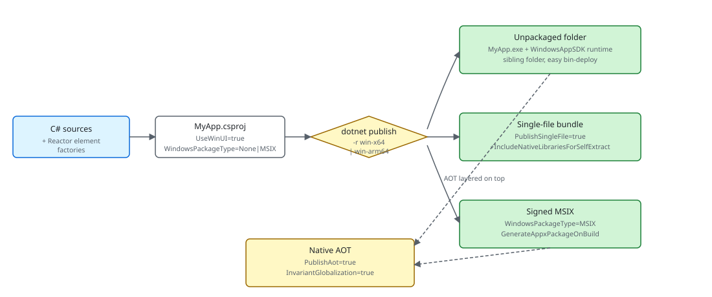

# Packaging

A Microsoft.UI.Reactor (Reactor) app is a normal WinUI 3 / Windows App SDK executable —
`dotnet publish` produces the deployable artifact and the framework
itself adds nothing exotic to the project file. What you choose at
publish time is the **shape** of that artifact: an unpackaged folder
(the [`dotnet new reactorapp`](getting-started.md) default), a signed
MSIX, a single-file bundle, or a Native AOT native binary — each
combined with a `win-x64` or `win-arm64` runtime identifier. The
trade-offs are the same ones any WinUI 3 app faces; the
Reactor-specific notes on this page cover what changes when your
codebase leans on the reflection-driven pieces of the framework
([`AutoColumns<T>`](data-system.md), devtools component discovery
when `Reactor.DevtoolsSupport` is enabled, and the `UseObservableTree`
INPC walker).

| Publish shape | Key properties | Runtime identifier | What you get |
|---|---|---|---|
| Unpackaged (template default) | `WindowsPackageType=None`, `WindowsAppSDKSelfContained=true` | `win-x64` / `win-arm64` | A folder with `MyApp.exe` and the WinUI 3 runtime alongside it. Run from anywhere; ship as a zip. |
| MSIX | `WindowsPackageType=MSIX`, `GenerateAppxPackageOnBuild=true`, signed via `PackageCertificateThumbprint` or `PackageCertificateKeyFile` | `win-x64` / `win-arm64` | A signed `.msix`. Required for Microsoft Store; the cleanest sideload story for enterprise. |
| Single-file | `PublishSingleFile=true`, `IncludeNativeLibrariesForSelfExtract=true` | `win-x64` / `win-arm64` (must be set) | One `.exe` that self-extracts the WinUI runtime to `%TEMP%/.net/` on first launch. |
| Native AOT | `PublishAot=true`, `InvariantGlobalization=true` (recommended) | `win-x64` / `win-arm64` (required) | A native binary with no JIT, no `Assembly.GetTypes()`, no `Reflection.Emit`. Fastest cold start; trim-only. |

The four shapes are not mutually exclusive — MSIX wraps any of the
three publish outputs, and AOT layers on top of either an unpackaged
folder or an MSIX. The decision is usually distribution-channel-first
(Store / sideload / direct download) and then performance-second.



## The unpackaged shape

`dotnet new reactorapp` scaffolds an unpackaged WinUI 3 project — the
shape every sample in this repo also uses:

```xml
<PropertyGroup>
  <OutputType>WinExe</OutputType>
  <TargetFramework>net10.0-windows10.0.22621.0</TargetFramework>
  <Platforms>x64;ARM64</Platforms>
  <ImplicitUsings>enable</ImplicitUsings>
  <Nullable>enable</Nullable>
  <UseWinUI>true</UseWinUI>
  <WindowsPackageType>None</WindowsPackageType>
</PropertyGroup>
```

The load-bearing properties are `UseWinUI=true` (pulls the WinUI 3
XAML runtime), `WindowsPackageType=None` (no MSIX wrapper —
`MyApp.exe` runs straight from the publish folder), and the explicit
`<Platforms>x64;ARM64</Platforms>` (Windows App SDK self-contained
builds reject the AnyCPU default — the template orders x64 first so
unqualified `dotnet build` picks the right default on x64 dev
machines, with ARM64 second for Snapdragon X). The
[`Microsoft.WindowsAppSDK.WinUI`](https://www.nuget.org/packages/Microsoft.WindowsAppSDK.WinUI)
sub-package brings the WinUI 3 SDK — reference assemblies plus the MSBuild
build/props/targets — while the native WinUI runtime is supplied by the
machine-wide Windows App Runtime install (or bundled into the publish output
when `WindowsAppSDKSelfContained=true`). That sub-package is what a consumer
gets transitively from `Microsoft.UI.Reactor`; the scaffolded template adds the
full
[`Microsoft.WindowsAppSDK`](https://www.nuget.org/packages/Microsoft.WindowsAppSDK)
metapackage on top at scaffold time (see below), because the self-contained
shape needs the Runtime redist the metapackage carries. Inside this repo the
correct reference is injected centrally from `Directory.Build.targets` and
versioned by `WindowsAppSDKWinUIVersion` / `WindowsAppSDKVersion` in
`Directory.Build.props`.

`WindowsAppSDKSelfContained=true` is the other load-bearing piece —
it bundles the WinUI runtime alongside the published exe so the app
runs without a separate Windows App Runtime install, **and** it lets
`dotnet watch run` survive hot-reload rebuilds (the Reactor Visual
Studio embedded-preview extension and any other `dotnet watch`-based
inner-loop tooling depends on this — incremental rebuilds otherwise
double-count transitive `Microsoft.WindowsAppSDK.*` references and
trip `Microsoft.WindowsAppSDK.ComponentReference.targets`' strict
version check). Flip it to `false` only if you've explicitly chosen
a framework-dependent distribution shape and your install
instructions tell users to install the WinAppRuntime first.

To ship this shape, `dotnet publish -c Release -r win-x64`. The
publish folder contains `MyApp.exe`, `Reactor.dll`, the WinUI runtime
(`Microsoft.WindowsAppRuntime.Bootstrap.dll`, the XAML compiler
output `MyApp.xbf`, etc.), and the .NET runtime if
`WindowsAppSDKSelfContained=true`. Zip it and you have a sideloadable
build that runs on any matching-arch Windows 10 1809+ machine.

## MSIX

For Microsoft Store distribution and most enterprise sideloading,
wrap the same publish output in an MSIX. The single-project MSIX
shape adds three properties on top of the unpackaged CSPROJ:

```xml
<PropertyGroup>
  <WindowsPackageType>MSIX</WindowsPackageType>
  <GenerateAppxPackageOnBuild>true</GenerateAppxPackageOnBuild>
  <AppxPackageSigningEnabled>true</AppxPackageSigningEnabled>
  <PackageCertificateThumbprint>...</PackageCertificateThumbprint>
</PropertyGroup>

<ItemGroup>
  <AppxManifest Include="Package.appxmanifest" />
</ItemGroup>
```

`Package.appxmanifest` declares the package identity (Publisher,
PackageFamilyName, capabilities, file-type associations). The
[WinUI 3 packaging docs](https://learn.microsoft.com/en-us/windows/apps/package-and-deploy/packaging/)
cover the manifest surface in full. The signing certificate is
either a Microsoft Store-issued cert (for Store submissions) or a
self-signed cert imported into `Cert:\CurrentUser\My` (for
sideloading). MSIX is the only shape that gives the app a package
identity — features like background tasks, share targets, and the
notifier APIs require it.

## Single-file publish

Single-file collapses the publish folder into one `.exe` that
self-extracts on launch. For a WinUI 3 app the native runtime bits
are not in managed assemblies, so the bare `PublishSingleFile=true`
leaves several DLLs alongside the binary — add
`IncludeNativeLibrariesForSelfExtract` to fold those into the bundle:

```xml
<PropertyGroup>
  <PublishSingleFile>true</PublishSingleFile>
  <SelfContained>true</SelfContained>
  <IncludeNativeLibrariesForSelfExtract>true</IncludeNativeLibrariesForSelfExtract>
  <RuntimeIdentifier>win-x64</RuntimeIdentifier>
</PropertyGroup>
```

The trade-off is first-launch latency — the runtime extracts the
embedded assemblies to `%TEMP%\.net\` (or the directory in
`DOTNET_BUNDLE_EXTRACT_BASE_DIR`) before the process starts. Two
Reactor-specific notes: `Assembly.Location` returns an empty string
inside a single-file bundle, so any code path that builds paths next
to the exe should use
[`AppContext.BaseDirectory`](https://learn.microsoft.com/en-us/dotnet/api/system.appcontext.basedirectory)
instead; and the
[`UsePersisted`](persistence.md) `Application` scope writes to
`%LOCALAPPDATA%\<AssemblyName>\` — single-file doesn't change that
location, but trimming away the assembly name (via
`<AssemblyName>` rename in a publish profile) does.

## ARM64

ARM64 is a second runtime identifier on the same project — the
`<Platforms>x64;ARM64</Platforms>` line in the project template
exists so MSBuild accepts the per-platform restore. Build for both
in CI by running publish twice:

```powershell
dotnet publish -c Release -r win-x64   -o out/x64
dotnet publish -c Release -r win-arm64 -o out/arm64
```

There is no separate Reactor build for ARM64 — `Reactor.dll` is
AnyCPU-equivalent managed code that compiles for both architectures
from the same source. The native bits below it (the WinUI 3 runtime
and any `System.Drawing.Common` / `TraceEvent` natives transitively
pulled in by Reactor) ship per-RID, which is why the runtime
identifier matters even for managed-only Reactor code. The repo's
sample apps default to `<Platforms>x64;ARM64</Platforms>`; the
`reactorapp` template uses `<Platforms>x64;ARM64;X86</Platforms>`
(X86 retained for parity with the WinUI 3 templates), but Reactor
itself is only tested on x64 / ARM64.

## Native AOT

Reactor's perf-bench projects publish under AOT and run cleanly —
the framework is built to be AOT-compatible on its hot path. The
shape is the same as any other AOT publish, with `PublishAot=true`
and a runtime identifier:

```xml
<PropertyGroup>
  <OutputType>WinExe</OutputType>
  <TargetFramework>net10.0-windows10.0.22621.0</TargetFramework>
  <Platforms>x64;ARM64</Platforms>
  <RootNamespace>StressPerf.Reactor</RootNamespace>
  <AssemblyName>StressPerf.Reactor</AssemblyName>
  <ImplicitUsings>enable</ImplicitUsings>
  <Nullable>enable</Nullable>
  <UseWinUI>true</UseWinUI>
  <WindowsPackageType>None</WindowsPackageType>
  <PublishAot>true</PublishAot>
</PropertyGroup>
```

`dotnet publish -c Release -r win-x64` produces a native binary —
no `coreclr.dll`, no JIT, ~50 ms cold start versus ~250 ms for the
JIT-based build on the same hardware. The project template gates
the same shape behind a `NativeAot` parameter:

```xml
<PropertyGroup>
    <OutputType>WinExe</OutputType>
    <TargetFramework Condition="'$(TargetFrameworkOverride)' == ''">net10.0-windows10.0.22621.0</TargetFramework>
    <TargetFramework Condition="'$(TargetFrameworkOverride)' != ''">TargetFrameworkOverride-windows10.0.22621.0</TargetFramework>
    <!--
        x64 first so an unqualified `dotnet build` / F5 picks the right default on the
        majority of dev machines. ARM64 second for Snapdragon X. X86 retained for parity
        with the WinUI 3 templates even though Reactor itself is only tested on x64 / ARM64.
    -->
    <Platforms>x64;ARM64;X86</Platforms>
    <UseWinUI>true</UseWinUI>
    <WindowsPackageType>None</WindowsPackageType>
    <!--
        WindowsAppSDKSelfContained bundles the Windows App SDK runtime alongside the
        published exe so the app:
          (a) runs from any folder without a separate Windows App Runtime install, and
          (b) survives `dotnet watch run` hot reload (used by the Reactor Visual Studio
              embedded-preview extension — spec 056). Incremental rebuilds otherwise
              double-count transitive Microsoft.WindowsAppSDK.* references and trip
              Microsoft.WindowsAppSDK.ComponentReference.targets' strict version check
              ("version 2.0.20;2.0.20 was referenced"). Self-contained bundling
              sidesteps that check.
        Tradeoff: ~30 MB extra in the publish output. To ship framework-dependent
        (smaller publish, requires the user to install Microsoft.WindowsAppRuntime
        separately) flip this to false and ensure your install instructions tell users
        to install the runtime first.
    -->
    <WindowsAppSDKSelfContained>true</WindowsAppSDKSelfContained>
    <TargetPlatformMinVersion>10.0.17763.0</TargetPlatformMinVersion>
    <SupportedOSPlatformVersion>10.0.17763.0</SupportedOSPlatformVersion>
    <Nullable>enable</Nullable>
    <!--
        Auto-resolve RuntimeIdentifier from the host SDK when the caller hasn't pinned
        Platform / RuntimeIdentifier explicitly. Lets `dotnet build` / `dotnet run`
        succeed without forcing -p:Platform=x64 on every invocation — WindowsAppSDK's
        self-contained build path requires a concrete RID.
    -->
    <RuntimeIdentifier Condition="'$(RuntimeIdentifier)' == '' And ('$(Platform)' == '' Or '$(Platform)' == 'AnyCPU' Or '$(Platform)' == 'Any CPU')">$(NETCoreSdkPortableRuntimeIdentifier)</RuntimeIdentifier>
    <!--#if (NativeAot) -->
    <PublishAot>true</PublishAot>
    <InvariantGlobalization>true</InvariantGlobalization>
    <!--#endif -->
</PropertyGroup>
```

Pass `dotnet new reactorapp --NativeAot true` to get the AOT-enabled
variant. `InvariantGlobalization=true` is paired with `PublishAot`
because the alternative — shipping the full ICU data — pulls in
trim warnings that the AOT analyzer flags as actionable.

> **Caveat:** **`AutoColumns<T>` and `Assembly.GetTypes()` are the two reflection
> surfaces to know about.** `Factories.AutoColumns<T>()` walks
> `typeof(T).GetProperties()` to build `FieldDescriptor`s for a
> [`DataGrid<T>`](data-system.md), so the generic argument carries
> `[DynamicallyAccessedMembers(PublicProperties | PublicConstructors)]`
> — call it from your component and the AOT analyzer threads the
> annotation back through your code. Hand-built `Column<T>(...)`
> columns avoid the reflection entirely and are the safe choice for
> trim-paranoid code. The devtools code path walks `Assembly.GetTypes()` to enumerate
> component types when the app opts into `Reactor.DevtoolsSupport`, which
> is incompatible with trimming and carries `[RequiresUnreferencedCode]`
> on every method that touches it. Leave the switch off for retail/AOT
> builds (the documented retail shape; see [Dev Tooling](dev-tooling.md)).

## Tips

**Pick distribution before performance.** MSIX is Store-only-ish
and gives you a real package identity; unpackaged + zip is the
easiest direct-download story; single-file is the same shape as
unpackaged with a slower first launch. AOT is independent of all
three — apply it once the distribution shape is settled.

**Publish for both architectures in CI from day one.** ARM64
Windows on Snapdragon X is a real audience now; an x64-only build
runs under emulation but pays a startup tax. The `<Platforms>` line
in the template leads with x64 (the majority dev-machine default)
and includes ARM64 — the missing piece is the second
`dotnet publish -r win-arm64` invocation in the build pipeline.

**Keep `Reactor.DevtoolsSupport` out of retail.** The
[`Reactor.DevtoolsSupport`](dev-tooling.md) runtime host configuration
option is a capability gate that nothing user-visible depends on at
runtime — but the code path it enables walks `Assembly.GetTypes()`.
Leaving it off for Release/AOT builds drops the devtools trim warning
and lets the linker remove that path. Devtools implementation types ship
in the optional, same-version `Microsoft.UI.Reactor.Devtools` package;
only add that package to app projects that intentionally expose
`--devtools`.

**Only reference `Microsoft.UI.Reactor.Advanced` when you actually use
it.** The optional, same-version
[`Microsoft.UI.Reactor.Advanced`](win2d-canvas.md) package hosts the
heavier optional subsystems (spec 062 §7): the Win2D canvas family
(`Win2DCanvas`, `Win2DAnimatedCanvas`, `Win2DVirtualCanvas`), the
**data grid** (`DataGrid` / `Column` / `AutoColumns`), the **Markdown**
renderer (`Markdown(...)`), the **charting** subsystem (`Charts` + the D3
primitives), and the **docking** subsystem (`DockManager`). Any consumer of
those must add its `<PackageReference>`. Adding it also pulls
`Microsoft.Graphics.Win2D` (~1 MB managed + ~3 MB native interop dll) into
your publish output and roots its WinRT activation chain for the AOT
trimmer, so apps that use none of the Advanced subsystems should leave
`Microsoft.UI.Reactor.Advanced` off their `<PackageReference>` list — that
keeps both the moved subsystems and the Win2D native payload out of your
build. That split is the whole reason Advanced is a sibling package and not
a folder inside `Reactor.dll`.

**`Reactor.dll` is in your publish output as a managed assembly,
not a tucked-away framework package.** Reactor ships as the public preview
NuGet package `Microsoft.UI.Reactor` version `0.1.0-preview.13`; local
source-built smoke packages still use `0.0.0-local` via `mur pack-local`.
Trim-friendly deployments don't get any framework-side magic; the same trimmer
configuration that works for any WinUI 3 app works here.

**`Microsoft.WindowsAppSDK` is added by the template at scaffold time,
not pinned in the checked-in CSPROJ.** The template file itself carries
only `Microsoft.UI.Reactor`; a `dotnet new` post-action then runs the
equivalent of `dotnet add package Microsoft.WindowsAppSDK`, so a freshly
scaffolded project gets the **latest stable** SDK rather than a version
frozen when the template shipped. The two references then sit
side-by-side in your CSPROJ, so the SDK version stays an obvious knob —
edit it there when you need a specific WinUI patch. If you skip the
template and reference `Microsoft.UI.Reactor` by hand, the SDK still
arrives transitively as `Microsoft.WindowsAppSDK.WinUI`; add the full
metapackage yourself when you want `WindowsAppSDKSelfContained=true` or
an MSIX, both of which need the Runtime redist. The repo-internal
`WindowsAppSDKVersion` MSBuild property only governs projects under this
clone (`Directory.Build.props`); consumer projects pick their version
directly.

**Debug builds of the scaffolded template auto-include the
`Microsoft.UI.Reactor.Devtools` package** (gated by a
`Condition="'$(Configuration)' == 'Debug'"` ItemGroup that adds both
the package and `RuntimeHostConfigurationOption
Reactor.DevtoolsSupport=true`). The scaffolded
`Properties/launchSettings.json` ships a second
`"<AppName> Devtools"` profile that passes `--devtools`; select it in
Visual Studio or VS Code — the default profile passes no arguments — to
light up the right-click devtools menu and the docked devtools window.
The Reactor Visual
Studio embedded-preview extension (spec 056) also relies on this
Debug wiring — its `dotnet watch run -- --devtools run --embed
--embed-host-pid <pid>` activation needs the devtools assembly
loadable in the user's process. That VSIX is the roughest and most
experimental consumer of this wiring today; keep the Debug-only
boundary in place unless you are deliberately testing the embedded
preview. Release builds drop both the package
and the host-config switch so the trim / AOT analyzers stay quiet;
move the ItemGroup out of the Debug condition if you want devtools
in Release too.

## Next Steps

- **[Dev Tooling](dev-tooling.md)** — Previous: the inner-loop side of the build pipeline (`mur pack-local`, `dotnet watch`, hot reload).
- **[Getting Started](getting-started.md)** — Where the `dotnet new reactorapp` template that produces the unpackaged shape comes from.
- **[Performance](performance.md)** — When you should reach for AOT (cold-start budgets, startup-perf benchmarks).
- **[Perf Instrumentation](perf-instrumentation.md)** — The ETW / EventPipe pipeline that survives AOT publish unchanged.
- **[Dev Tooling](dev-tooling.md)** — How the `Reactor.DevtoolsSupport` capability switch combines with `--devtools` activation.
