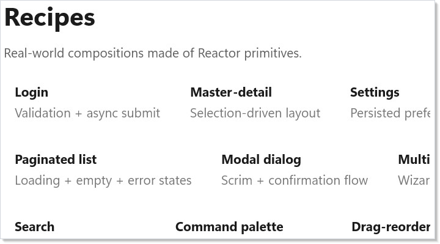

# Recipes

A recipe is a small composition of Microsoft.UI.Reactor (Reactor) primitives that solves a
real UI problem — login, master-detail, settings, paginated list,
modal confirmation, multi-step form, search-with-suggestions, command
palette, drag-to-reorder. The recipes here are not exhaustive apps;
each is a single screen showing the pattern, and each ships a tiny
doc app you can clone and adapt.

## Gallery

| Recipe | What it shows |
|---|---|
| [Login](login.md) | Per-keystroke validation, `UseMutation`-owned submit state, error display. |
| [Master-detail](master-detail.md) | Two-pane selection-driven layout from a list and a record. |
| [Settings page](settings-page.md) | Per-key `UsePersisted` for `Toggle` / `ComboBox` / `Slider`. |
| [Paginated list](paginated-list.md) | `UseInfiniteResource` with empty / loading / error states and a load-more sentinel. |
| [Modal dialog](modal-dialog.md) | Confirmation pattern with scrim and conditional render. |
| [Multi-step form](multi-step-form.md) | Wizard navigation with per-step validation. |
| [Search with suggestions](search-with-suggestions.md) | `UseMemo`-filtered suggestion list against a static catalog. |
| [Command palette](command-palette.md) | Keyboard accelerator opening an overlay with a filtered command list. |
| [Drag-reorder](drag-reorder.md) | Identity-preserving reorder of a keyed list, with a keyboard path. |

## The gallery app

```csharp
class RecipesIndexApp : Component
{
    public override Element Render() => VStack(12,
        Heading("Recipes"),
        TextBlock("Real-world compositions made of Reactor primitives.")
            .Opacity(0.7),
        VStack(8,
            HStack(8,
                Tile("Login", "Validation + async submit"),
                Tile("Master-detail", "Selection-driven layout"),
                Tile("Settings", "Persisted preferences")),
            HStack(8,
                Tile("Paginated list", "Loading + empty + error states"),
                Tile("Modal dialog", "Scrim + confirmation flow"),
                Tile("Multi-step form", "Wizard validation")),
            HStack(8,
                Tile("Search", "Memoized suggestions"),
                Tile("Command palette", "Keyboard-opened overlay"),
                Tile("Drag-reorder", "Keyed list reordering"))
        )
    ).Padding(20);

    private static Element Tile(string title, string sub) => VStack(4,
        TextBlock(title).Bold(),
        TextBlock(sub).Opacity(0.6)
    ).Padding(12);
}
```



The gallery uses the same primitives every recipe page does — a
`VStack` for the column layout, `TextBlock` for descriptions, and
`HStack` for each tile row. The tile helper is a private static method, not a
component, so it has no hook scope:

```csharp
private static Element Tile(string title, string sub) => VStack(4,
    TextBlock(title).Bold(),
    TextBlock(sub).Opacity(0.6)
).Padding(12);
```

Every page in this folder follows the same shape:

```csharp
// Every recipe page in this folder pulls a tiny dedicated doc app under
// docs/_pipeline/apps/recipe-<name>/. The recipe template renders three
// snippet markers (state / shape / render) plus one screenshot for the
// gallery thumbnail above.
class GalleryShape : Component
{
    public override Element Render() => TextBlock("see docs/_pipeline/apps/recipe-*");
}
```

## How to read a recipe

Every recipe has the same shape:

1. **A snippet of the recipe's working code**, pulled from a real
   doc app under `docs/_pipeline/apps/recipe-<name>/`.
2. **A screenshot of the recipe running**, captured by the
   doc-pipeline harness.
3. **A walkthrough paragraph or two** naming the primitives the
   recipe combines and the design decisions that hold the pattern up.

The recipes prefer composition of existing factories — no custom
`Component` per recipe. If you want the recipe in your app, copy the
snippet and replace the catalog data with yours.

## Reference

| Primitive | Used in |
|---|---|
| `UseState` | Most recipes. |
| `UsePersisted` | [Settings](settings-page.md). |
| `UseMemo` | [Search](search-with-suggestions.md). |
| `UseMutation` | [Login](login.md) — async submit, pending, error. |
| `UseInfiniteResource` | [Paginated list](paginated-list.md). |
| Conditional render | [Modal dialog](modal-dialog.md), [Command palette](command-palette.md). |
| Two-pane HStack | [Master-detail](master-detail.md). |
| Keyed children | [Drag-reorder](drag-reorder.md). |

## Tips

**Reach for a recipe before custom code.** Most "I need a settings
page" or "we need a login form" needs are met by one of these
patterns. The recipe is the composition; the cost of inventing your
own is the cost of debugging it.

**Recipes are starting points, not products.** Drop the snippet into
your app and adapt it — the data, the styling tokens, the validation
rules. The shape of the composition is the value here.

**Search the controls catalog before reaching for a recipe.** A
problem solved by a single control ([forms](../forms.md),
[data-system](../data-system.md)) doesn't need a recipe; recipes
exist for shapes that span multiple controls and hooks.

## Next Steps

- **[Controls](../controls.md)** — Previous: the catalog of factories
  the recipes compose.
- **[Forms](../forms.md)** — Forms-heavy recipes start here.
- **[Async Resources](../async-resources.md)** — Behind the Login and
  Paginated-list recipes.
- **[Persistence](../persistence.md)** — Behind the Settings recipe.
- **[Commanding](../commanding.md)** — Backs the Command-palette recipe.
- **[Navigation](../navigation.md)** — Recipes that span multiple
  screens lean on this.
