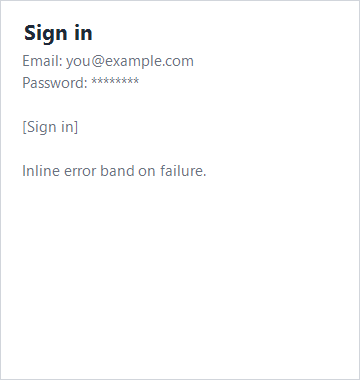

# Recipe: Login

A Microsoft.UI.Reactor (Reactor) login form is four pieces working together: validated input,
submit-gated state, an async call, and an error-display surface. The
recipe below wires them with two `UseState` hooks and one
[`UseMutation`](../async-resources.md) — no view model, no event
handler classes, and no hand-rolled `submitting` / `error` flags.

## Primitives

| Concern | API |
|---|---|
| Per-field state | `UseState<string>` |
| Async submit + pending + error | [`UseMutation`](../async-resources.md) |
| Submit-disabled gating | `.IsEnabled(canSubmit)` |
| Error display | Conditional `Empty()` vs `TextBlock` |
| Password input | [`PasswordBox`](../forms.md) |

### State

```csharp
// Only the two input fields are hand-held state. The in-flight flag
// and the last error belong to the mutation below, not to UseState.
var (email, setEmail) = UseState("");
var (pwd, setPwd) = UseState("");
```

Two `UseState` calls — email and password. Nothing else needs a hook
slot of its own: the in-flight flag and the last error are owned by the
mutation, not duplicated into component state.

### Async submit

```csharp
// UseMutation owns IsPending / Error / LastResult and cancels the
// in-flight call on unmount. The mutator throws on failure; the hook
// captures the exception into signIn.Error and re-renders.
var signIn = UseMutation<(string Email, string Password), bool>(
    mutator: async (input, ct) =>
    {
        await Task.Delay(800, ct);                   // pretend API call
        if (input.Password == "wrong")
            throw new InvalidOperationException("Invalid credentials.");
        return true;
    });
```

[`UseMutation`](../async-resources.md) is the write-side counterpart to
`UseResource`. It returns a `Mutation<TInput, TResult>` handle that is
stable across renders and exposes exactly the three things a submit
button needs: `IsPending`, `Error`, and `LastResult`. The mutator
receives a `CancellationToken` that fires on unmount, so a submit
in flight when the user navigates away is cancelled rather than
completing against a dead component.

Failure is signalled by throwing. The hook catches the exception,
stores it on `Error`, and re-renders — which is why there is no
`try/finally` and no `setSubmitting(false)` in the recipe.

> **Caveat:** Don't reintroduce `var (submitting, setSubmitting) = UseState(false)`
> alongside a mutation. Two sources of truth for "is a submit running"
> drift the moment a call is cancelled or a second submit overlaps —
> `IsPending` is a count of in-flight calls and already handles both.

### Per-keystroke validation

```csharp
// Local validation runs on every keystroke. The submit button is
// disabled until the form is valid; in-flight submits are gated by
// the same predicate, reading the mutation's own pending flag.
var emailValid = email.Contains('@') && email.Contains('.');
var pwdValid = pwd.Length >= 8;
var canSubmit = emailValid && pwdValid && !signIn.IsPending;
```

The form derives `emailValid` and `pwdValid` from raw state on every
render — no debounce, no separate validation pass. Re-rendering on
every keystroke is fine in Reactor; the work happens in pure C# and
the reconciler skips slots that didn't change.

### Render

```csharp
return VStack(12,
    Heading("Sign in"),
    TextBox(email, setEmail, placeholderText: "you@example.com",
        header: "Email").Width(280),
    PasswordBox(pwd, setPwd, placeholderText: "8+ characters"),
    signIn.Error is null
        ? Empty()
        : TextBlock(signIn.Error.Message).Foreground("#C42B1C"),
    Button(signIn.IsPending ? "Signing in…" : "Sign in",
            () => _ = signIn.RunAsync((email, pwd)))
        .IsEnabled(canSubmit)
).Padding(20).Width(320);
```



The `canSubmit` predicate gates the button on a single render —
disabling the button is enough; an analyzer-flagged guard inside the
mutator would double-fire on a re-render race. `signIn.IsPending` owns
both the spinner label ("Signing in…") and the disabled state, so an
in-flight submit can't be re-triggered by an Enter press.
`() => _ = signIn.RunAsync((email, pwd))` is the standard fire-and-
forget shape: the returned task carries the same fault that
`signIn.Error` already holds, so the UI reads the handle rather than
awaiting.

## Tips

**Don't reach for a view model.** A 30-line login form doesn't need
one; the two `UseState` hooks and the mutation are the view model. The
cost of a class hierarchy is the cost of maintaining it.

**Let the mutation own pending and error.** Every `UseState` bool you
add next to `IsPending` is a state machine you now have to keep in
sync with the hook's. Use `MutationOptions.OnSuccess` when you need to
run something after a successful submit (navigate, clear the form)
rather than polling `LastResult` from an effect.

**Gate at the button, not inside the handler.** A disabled button is
a single render check; a guard inside the mutator runs after the user
already pressed it and the UI looked ready. Both layers are good
hygiene but the button gate is the load-bearing one.

**Use [`PasswordBox`](../forms.md), not `TextBox` with a hex style.**
The control implements paste-without-reveal, autofill, and the
accessibility peer; reinventing it in user code drops those.

## Next Steps

- **[Async Resources](../async-resources.md)** — `UseMutation`'s full
  option surface: optimistic updates, cache invalidation, callbacks.
- **[Forms](../forms.md)** — The full input + validation surface this
  recipe pulls from.
- **[Effects](../effects.md)** — Cancellation pattern when the user
  navigates away mid-submit.
- **[Recipe: Modal dialog](modal-dialog.md)** — Pair this with a
  "Forgot password?" modal.
- **[Accessibility](../accessibility.md)** — Focus order rules that
  apply once you add more fields.
- **[Recipes index](index.md)** — Back to the gallery.
