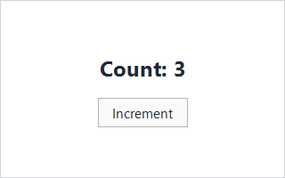

# Testing

Microsoft.UI.Reactor (Reactor)'s render loop is deterministic and synchronous. A `Component`
mounted in a unit test renders, runs effects, accepts state updates,
re-renders, and disposes through the same code path the WinUI host
uses — minus the WinUI tree at the bottom. That makes the unit layer
fast (the framework's own xUnit run finishes in seconds), and it
keeps test bodies focused on the component's behavior instead of the
windowing chrome.

Reactor has **three** test suites, one per project, plus the doc
pipeline which compiles every published sample:

```csharp
class Counter : Component
{
    public override Element Render()
    {
        var (count, setCount) = UseState(0);
        return VStack(8,
            TextBlock($"Count: {count}").FontSize(20).Bold(),
            Button("Increment", () => setCount(count + 1))
        ).Padding(16);
    }
}
```



## Reference

| Suite | Project | Runner | When to reach for it |
|---|---|---|---|
| Unit | `tests/Reactor.Tests/` | xUnit | Hook semantics, reducer logic, modifier chains, reconciliation algorithms, Yoga layout, analyzer rules. Fastest loop, **no WinUI window**. |
| Self-test | `tests/Reactor.SelfTests/` (fixtures in `Reactor.AppTests.Host`) | MSTest wrapping a TAP subprocess | Component renders into a real WinUI tree; assertions via `VisualTreeHelper`. |
| App E2E | `tests/Reactor.AppTests/` | MSTest + winapp ui | Real user input, UIA properties as seen by assistive tech, cross-process behavior. |

Every suite runs on **Microsoft.Testing.Platform**. Full-suite commands are
plain:

<!-- ai:lock -->
```
dotnet test tests/Reactor.Tests -p:Platform=x64
dotnet test tests/Reactor.SelfTests
dotnet test tests/Reactor.AppTests
```
<!-- /ai:lock -->

For targeted runs, use the runner's current filter syntax: xUnit suites
prefer MTP's `--filter-class` / `--filter-method` family, while the MSTest
self-test and E2E suites keep VSTest-style `--filter` expressions:

<!-- ai:lock -->
```
dotnet test tests/Reactor.Tests --filter-class "*ReconcilerMountUpdateTests*"
dotnet test tests/Reactor.SelfTests --filter "ClassName~SkipReportingTests"
dotnet test tests/Reactor.AppTests --filter "ClassName=Microsoft.UI.Reactor.AppTests.Tests.AccessibilityTests"
```
<!-- /ai:lock -->

The doc apps under `docs/_pipeline/apps/` are a fourth compile gate
rather than a test suite: `mur docs compile` builds every one of them,
so a snippet in this guide that names a removed API fails the docs
build.

> **Caveat:** **A headless unit test cannot construct any `Microsoft.UI.Xaml` object.**
> There is no XAML application object behind an xUnit run, so `new Button()`,
> a brush, a geometry, a `BitmapImage`, or any `AutomationPeer`-derived type
> throws `COMException` the moment you touch it. Unit tests may exercise pure
> managed logic plus WinRT value structs and enums — `Element` records,
> modifiers, hooks, layout math, the accessibility scanner — and nothing
> that materializes a control. The moment a test needs a live control,
> it belongs in a self-test fixture, not in `tests/Reactor.Tests`.

## Unit-level fixtures

> **This section is for tests inside this repository.** Reactor's component
> lifecycle (`BeginRender` → `Render` → `FlushEffects` → `RunCleanups`),
> `Component.Context` and `ContextScope` are **internal**. They are visible to
> `tests/Reactor.Tests` only because `src/Reactor/Reactor.csproj` grants it
> `InternalsVisibleTo`, so the helper below **will not compile in a consumer test
> project** — it is shown to explain how Reactor's own fixtures are written, not
> as code to copy into your app's tests. To test your own components from
> outside the repo, use the public surface shown in
> [Structural assertions](#structural-assertions-on-the-element-tree),
> or drive a real control from a self-test.

The lifecycle is used directly by `ContextSystemSelfHostTests` and
`ComponentModelIntegrationTests` in `tests/Reactor.Tests/`, wrapped in a
per-class helper:

```csharp
private static Element MountComponent(
    Component component, ContextScope scope,
    Dictionary<ContextBase, object?>? contextValues = null)
{
    if (contextValues is { Count: > 0 })
        scope.Push(contextValues);

    try
    {
        component.Context.BeginRender(() => { }, scope);
        var element = component.Render();
        component.Context.FlushEffects();
        return element;
    }
    finally
    {
        if (contextValues is { Count: > 0 })
            scope.Pop(contextValues.Count);
    }
}
```

The helper returns the root element. The test then drives state via the
component's own public surface (a property the component exposes, or a
captured setter from `UseState`), calls the helper again to re-render,
and asserts. When the fixture owns effects with `dispose` lambdas, call
`component.Context.RunCleanups()` before the next test starts. Pushing
and popping the `ContextScope` in a `try/finally` matters: a test that
throws mid-render would otherwise leak its context values into the next
test in the class.

The full pattern is in `ComponentModelIntegrationTests.cs` — that file
mounts a component with state + context + effects, drives 5 distinct
lifecycle transitions, and asserts the effect log after each. Use it
as the template when adding a unit fixture for a new hook.

## Effect-aware async tests

`UseEffect` does not fire during render. It fires when the component's
context flushes effects — which the unit `Mount` helper above does
inline. Tests that exercise effect ordering must observe the log
between mount and the next render, not during render:

```csharp
// Effect-aware component used as a fixture target. UseEffect fires on the
// next flush, not during render — tests must wait for the flush before
// observing the side effect's log entry (see testing.md, "Async patterns").
class EffectfulCounter : Component
{
    public List<string> Log { get; } = new();

    public override Element Render()
    {
        var (count, setCount) = UseState(0);
        UseEffect(() =>
        {
            Log.Add($"effect:{count}");
            return () => Log.Add($"cleanup:{count}");
        }, count);
        return Button($"count={count}", () => setCount(count + 1))
            .AutomationName($"Counter is {count}");
    }
}
```

A test for `EffectfulCounter` mounts the component, asserts
`Log = ["effect:0"]`, increments state, re-renders, and asserts
`Log = ["effect:0", "cleanup:0", "effect:5"]`. The cleanup from the
previous effect runs before the new effect's body — that's the
contract `tests/Reactor.Tests/ComponentModelIntegrationTests.cs` codifies.

For genuinely async work (an HTTP fetch, a timer), don't hand-roll it
inside `UseEffect`: [`UseResource`](async-resources.md) already owns
the `CancellationToken`, the loading/error states, and cancellation on
unmount, so a test can drive it by controlling the fetcher it was
handed. When the component must own its own task, expose the
completion `Task` so the test can `await` it deterministically — or
inject a fake clock via `UseContext` of a clock interface and tick it
forward by hand. Avoid `Thread.Sleep` in tests; it leaks wall-clock
time into the suite and makes CI flaky.

## Structural assertions on the element tree

There is no golden-file snapshot harness in Reactor, and none is
needed: `Element` is a `record`, so a rendered tree is a value you can
assert against directly. Pattern-match the shape you care about
instead of stringifying the whole tree — a structural assertion names
the property under test, so its failure message points at the defect
rather than at a 200-line text diff:

```csharp
[Fact]
public void Component_TProps_Renders_With_Props()
{
    var comp = new GreetingComponent { Props = "Alice" };
    var el = comp.Render();
    Assert.IsType<TextBlockElement>(el);
    Assert.Equal("Hello, Alice!", ((TextBlockElement)el).Content);
}
```

Assert on the slots the component is responsible for, not on every
field of every element. A test that pins padding, font size, and
child order together fails for three unrelated reasons and tells you
which one only after you read the diff. Never assert on anything
carrying a timestamp, a generated id, or a hash — normalize it or
factor it out of the component under test.

## Accessibility scanner integration

[`AccessibilityScanner.Scan(root)`](accessibility.md) walks an element
tree and returns a `List<A11yDiagnostic>`, one per finding, each
carrying a rule `Id` (`"A11Y_001"` … ), a `Severity`, a
`WcagCriterion`, and a `Fix` suggestion. It takes an `Element`, not a
control, so it runs in the headless unit suite:

```csharp
// AccessibilityScanner fixture targets. The scanner walks an element tree
// and returns one A11yDiagnostic per finding, each carrying a rule Id
// ("A11Y_001" = icon-only Button with no accessible name).
class IconOnlyButton : Component
{
    public override Element Render() =>
        Button(TextBlock("🔍"));            // icon content, no accessible name
}

class NamedButton : Component
{
    public override Element Render() =>
        Button(TextBlock("🔍"), null).AutomationName("Search");
}
```

```csharp
[Fact]
public void A11Y_001_IconButton_Without_AutomationName()
{
    var tree = VStack(
        Button(TextBlock("🔍"), null) // icon content, no AutomationName
    );

    var findings = AccessibilityScanner.Scan(tree);
    Assert.Contains(findings, f => f.Id == "A11Y_001");
}

[Fact]
public void A11Y_001_IconButton_With_AutomationName_Passes()
{
    var tree = VStack(
        Button(TextBlock("🔍"), null).AutomationName("Search")
    );

    var findings = AccessibilityScanner.Scan(tree);
    Assert.DoesNotContain(findings, f => f.Id == "A11Y_001");
}
```

Assert `DoesNotContain` on the specific rule id rather than `Empty` on
the whole list: a fixture that asserts the scan is completely clean
starts failing the day an unrelated rule is added, and the failure
will not be about the thing the test was written to protect.

The same scanner backs the in-app dev menu's "Run accessibility scan"
button, so a fixture that passes here is the same shape that passes in
the running app. Treat scanner-clean as the standing bar for every new
component you ship.

## Self-tests (real WinUI tree)

`Reactor.SelfTests` is the layer between the unit suite (pure C#, no
WinUI) and the full E2E suite (winapp ui). A self-test mounts a
real fixture into the `Reactor.AppTests.Host` window, walks the WinUI
visual tree, and emits TAP. The MSTest wrapper in `SelfTestBatch.cs`
parses the TAP and surfaces one test method per fixture.

To add a self-test:

1. Add a new fixture file under
   `tests/Reactor.AppTests.Host/SelfTest/Fixtures/` returning the component
   under test wrapped in a small assertion harness.
2. Register it in **two** places in
   `tests/Reactor.AppTests.Host/SelfTest/SelfTestFixtureRegistry.cs` — the
   `AllFixtures` list *and* the `Create()` switch. Miss the second and
   `--list-fixtures` reports a name the run cannot produce, which shows up
   as a confusing "missing fixture" failure rather than a compile error.
3. The MSTest wrapper picks it up at discovery time via
   `--list-fixtures`; no code change needed on the test runner side.

E2E fixtures have the same two-place split, in
`tests/Reactor.AppTests.Host/FixtureRegistry.cs` (`AllFixtures` plus the
`Build` switch). `--list-fixtures` is self-test-only, so nothing warns
you about the E2E half.

Reach for a self-test when the unit layer can't see the answer — e.g.
when the WinUI control's measured size affects the component's
behavior, or when an automation peer's role depends on the
materialized XAML control class.

A fixture asserts with `H.Check(name, condition)`. When the machine
genuinely cannot run a check — a locked desktop, an OS version without
the API — use `H.Skip(name, reason)` instead of quietly returning. A
fixture that skipped every check and asserted nothing is reported as
**Skipped**, not Passed, so "this machine could not test it" stays
distinguishable from "this machine tested it and it worked". Prefer
asserting the environment probe itself and skipping only the part that
depends on it, so the fixture still proves something everywhere. Put an
issue number in the reason when the skip marks a real product gap: a
skip is never evidence the product works, only that this run did not
establish otherwise.

## Tips

**Don't drive the unit fixture from `Task.Delay`.** If an effect
schedules async work, expose its completion task so the test can
`await` it. Wall-clock delays leak into the suite and make CI flaky.

**Assert on the tree's structure, not on rendered pixels.** `Element`
records give you typed slots you can pattern-match; an actual rendered
bitmap depends on font rendering, DPI, and platform Composition — none
of which belong in a unit test.

**Run the accessibility scan in every fixture's teardown.** It's
cheap, it takes an `Element` rather than a control so it works
headlessly, and it puts the scanner's output next to the test that
introduced the problem.

**Use `Reactor.AppTests` only where xUnit and self-tests can't reach.**
The winapp ui E2E suite is the slow lane; reserve it for keyboard navigation,
focus order, and click sequences that depend on Composition or input
routing.

## Next Steps

- **[Hooks](hooks.md)** — Previous in the learning path: the
  primitives a fixture exercises.
- **[Effects](effects.md)** — `UseEffect` lifecycle and cleanup,
  including the flush ordering tested above.
- **[Accessibility](accessibility.md)** — The scanner's rules and how
  to extend it with project-specific checks.
- **[Dev Tooling](dev-tooling.md)** — `mur` CLI, preview mode, and the
  doc-pipeline harness that powers the screenshots on this page.
- **[Components](components.md)** — Render purity rules that make the
  unit layer worth the investment.
