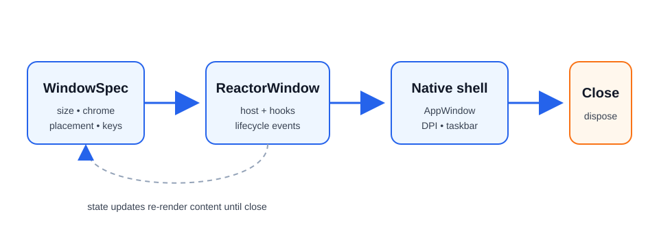

> **WinUI reference:** For the full property surface and design guidance, see [Windowing Overview](https://learn.microsoft.com/en-us/windows/apps/windows-app-sdk/windowing/windowing-overview).

# Windows

Most Microsoft.UI.Reactor (Reactor) apps start with the single window created by
`ReactorApp.Run`. Larger desktop apps can open multiple native WinUI top-level
windows with `WindowSpec` and `ReactorApp.OpenWindow`, while keeping the same
declarative component model used inside a page.



## Lifecycle basics

`ReactorApp.Run<TRoot>(...)` opens the primary window. Pass a `WindowSpec` instead
of the individual arguments when the primary window needs the full declarative
surface — icon, min/max size, backdrop, corner style, or placement persistence.
`ReactorApp.OpenWindow` opens a secondary window from the UI thread and returns a
`ReactorWindow` handle for imperative lifecycle operations.

```csharp
ReactorApp.Run<WindowsApp>("Windows Demo", width: 640, height: 520
);
```

```csharp
public static void OpenSettings()
{
    var settings = ReactorApp.OpenWindow(
        new WindowSpec { Title = "Settings", Width = 520, Height = 420 },
        () => new SettingsWindow());

    settings.Activate();
    settings.Close();
}
```

Caveats:

- `Close`, `Show`, `Hide`, `Activate`, `Update`, and mutators are UI-thread only.
- `Close()` is idempotent: calling it more than once (or while an owner-close
  cascade is already tearing the window down) performs the native close exactly
  once. A redundant close is a safe no-op, so converging teardown paths can't
  re-enter native window destruction.
- `ReactorApp.PrimaryWindow` is the first *eligible* opened window; shutdown
  policy decides whether closing it exits the process. Auxiliary windows that
  opt out of the shutdown policy — notably docking tear-off floating windows —
  are excluded
  from primary election: they can never become the fallback primary, and they
  are never promoted to primary when the real primary closes (re-election skips
  them, leaving `PrimaryWindow` `null` if only excluded windows remain). This
  keeps closing a transient floating window from firing
  `OnPrimaryWindowClosed` and exiting the app.
- `UseWindow()` returns the owning `ReactorWindow` inside a window component and
  `null` outside one (for example tray flyouts).

## Sizing & resizing

Initial `Width` / `Height` are DIPs, and both are optional — leave them unset
(the default) to let the OS choose the initial window size, exactly as a plain
XAML `Window` does. Setting only one axis applies that axis and leaves the other
to the OS. Runtime size is controlled by `SetSize`,
chrome resize policy by `ResizeMode`, interactive aspect locks by `AspectRatio`,
and content-driven sizing by `SizeToContent`.

```csharp
class PreviewWindow : Component
{
    public static WindowSpec Spec => new()
    {
        Title = "Preview",
        Width = 640,
        Height = 360,
        ResizeMode = WindowResizeMode.CanMinimize,
        AspectRatio = 16.0 / 9.0,
    };

    public override Element Render()
    {
        var window = UseWindow();

        UseWindowAspectRatio(1.0); // lifetime-bound hook; unmount clears it

        return Button("Widescreen", () => window?.SetAspectRatio(4.0 / 3.0));
    }
}
```

| API | Values / behavior |
| --- | --- |
| `ResizeMode` | `CanResize`, `NoResize`, `CanMinimize` |
| `AspectRatio` | `double?` width / height; honored during drag resize |
| `SizeToContent` | `Manual`, `Width`, `Height`, `WidthAndHeight` |

Caveats:

- `AspectRatio` rejects `ResizeMode.NoResize`; no drag means no constraint to apply.
- `AspectRatio` and `SizeToContent` are mutually exclusive layout drivers.
- `SizeToContent` runs after layout, so the first frame can briefly use the
  initial `Width` / `Height` (or the OS-chosen size when they are unset);
  maximized windows ignore it and log a warning.
- Min/max fields (`MinWidth`, `MaxHeight`, etc.) win over content and aspect sizing.

## Movement & placement

Use `StartPosition` for initial placement, `SetPosition` for imperative moves,
`Position` for read-back, and `PositionChanged` / `UseWindowPosition()` to react
to live moves.

```csharp
class CommandPalette : Component
{
    public static WindowSpec Spec => new()
    {
        Title = "Command Palette",
        StartPosition = WindowStartPosition.CenterOnCurrent,
        IsMovableByBackground = true,
    };

    public override Element Render()
    {
        var (x, y) = UseWindowPosition();
        var drag = UseWindowDragMove();

        return VStack(8,
            TextBlock($"at {x}, {y}"),
            Button("Drag window", drag));
    }
}
```

`IsMovableByBackground` starts the OS move loop when a non-interactive part of
the root is pressed. Mark custom interactive regions with `.Drag(false)`:

```csharp
class PaletteChrome : Component
{
    public override Element Render() =>
        HStack(
            TextBlock("Palette"),
            Button("Settings").Drag(false));
}
```

Placement options:

| `WindowStartPosition` | Meaning |
| --- | --- |
| `Default` | WinUI / shell chooses placement |
| `CenterOnPrimary` | Center on primary monitor |
| `CenterOnOwner` | Center on the owner window's monitor |
| `CenterOnCurrent` | Center on the cursor monitor |
| `Manual` | Use `ManualPosition` DIP top-left |

Persistence is opt-in and explicit:

```csharp
public static WindowSpec ShellSpec { get; } =
    new WindowSpec { Title = "Shell" }
        .WithPersistence("main-window", fallback: WindowStartPosition.CenterOnCurrent);

public static void FlushPlacement(ReactorWindow window)
{
    window.SavePlacement(); // manual best-effort flush
}
```

Caveats:

- Position values are DIPs; mixed-DPI desktops have no single global DIP grid.
- `PositionChanged` fires eagerly during drags; debounce in app code if needed.
- `PersistenceId` alone is only identity. Placement restore/save requires
  `PersistPlacement = true` or `.WithPersistence(...)`.

## Z-order & visibility

`WindowLevel` selects a z-order tier. `ShowInTaskbar` and `ShowInSwitcher` are
separate because the taskbar button and Alt-Tab visibility are separate shell
concepts.

```csharp
class FloatingPalette : Component
{
    public static WindowSpec Spec => new()
    {
        Title = "Palette",
        Level = WindowLevel.Floating,
        ShowInTaskbar = false,
        ShowInSwitcher = true,
    };

    public override Element Render()
    {
        var isCovered = UseIsCovered(); // hint from ZOrderChanged
        return TextBlock(isCovered ? "(covered)" : "(visible)");
    }
}
```

| `WindowLevel` | Behavior |
| --- | --- |
| `Normal` | Regular z-order |
| `Floating` | Stays above owner and other Reactor app windows as they activate |
| `AlwaysOnTop` | Win32 topmost tier |

| `ShowInTaskbar` | `ShowInSwitcher` | Result |
| --- | --- | --- |
| `true` | `true` | Normal app window |
| `true` | `false` | Taskbar button, no Alt-Tab entry |
| `false` | `true` | Tool palette shape |
| `false` | `false` | Transient / launcher / overlay shape |

Caveats:

- `ZOrderChanged.IsCovered` is a covered hint based on HWND insertion order, not
  pixel-accurate occlusion.
- `Floating` is app-local. Use `AlwaysOnTop` only when you need global topmost.
- Runtime taskbar visibility flips hide/show the HWND once so the shell refreshes.

## Chrome & appearance

`WindowStyle` controls native chrome. `WindowCornerStyle` maps to the Windows 11
DWM corner preference. Backdrops are applied either on `WindowSpec.Backdrop` or
with a root `.Backdrop(...)` modifier.

```csharp
public static WindowSpec HudSpec { get; } = new()
{
    Title = "HUD",
    Style = WindowStyle.None,
    IsMovableByBackground = true,
    CornerStyle = WindowCornerStyle.Rounded,
    Backdrop = BackdropChoice.Of(BackdropKind.DesktopAcrylic),
};
```

| API | Values |
| --- | --- |
| `WindowStyle` | `Default`, `None`, `ToolWindow` |
| `WindowCornerStyle` | `Default`, `Square`, `Rounded`, `RoundedSmall` |
| `BackdropKind` | `None`, `Mica`, `MicaAlt`, `DesktopAcrylic`, `AcrylicThin`, `Transparent` |

`TitleBar(...)` is the declarative custom title bar. When `WindowSpec.ExtendsContentIntoTitleBar`
is `null` (the default), mounting a `TitleBar(...)` element automatically sets
`Window.ExtendsContentIntoTitleBar = true`. Explicit `true` or `false` on the
spec wins over inference.

```csharp
class TitleBarWindow : Component
{
    public override Element Render() =>
        VStack(
            TitleBar("My app"),
            TextBlock("Body"));
}
```

`TitleBar(...)` accepts custom `Content` (and a trailing `RightHeader`). Interactive
controls inside the content are excluded from the window drag region automatically
(WinApp SDK ≥ 2.1.3). Override per element with `.IsDragRegion(false)` to force a
visual clickable or `.IsDragRegion(true)` to force it draggable, and set
`.AutoRefreshDragRegions()` on the title bar when the content changes across renders:

```csharp
(TitleBar("Gallery") with
{
    Content = HStack(8,
        AutoSuggestBox("", _ => {})
            .AutomationName("Search gallery")
            .Width(200),
        Button(Icon(FontIcon("\uE713", fontSize: 16)), OnSettings)
            .AutomationName("Settings").IsDragRegion(false)),
}).AutoRefreshDragRegions();
```

### Title bar icon

A `TitleBar(...)` with no `.Icon(...)` shows the **window's** icon: `WindowSpec.Icon`
if one was declared, otherwise the `Assets\AppIcon.ico` convention. An app that
already ships an icon does not restate it:

```csharp
ReactorApp.Run<App>("MyApp", icon: WindowIcon.FromPath("Assets/AppIcon.ico"));

// ...and in Render(), nothing more to say:
var titleBar = TitleBar("MyApp");
```

The WinUI control does not do this itself. Two limits are worth knowing:

- An icon that exists *only* as an executable PE resource (`<ApplicationIcon>`) is
  **not** inherited. That stage of the window's own icon chain yields a raw `HICON`
  with no path, and a XAML `IconSource` needs an image source. The window caption and
  Alt-Tab still show it; the in-window title bar does not.
- An embedded window (`WindowSpec.Embed`) never receives a window icon, so its title
  bar has none to inherit.

`.Icon(...)` still wins where you want a different mark — a monochrome glyph in the
title bar against a full-colour `.ico` in the caption, say. `.NoIcon()` is the
opt-out for a deliberately bare title bar on an app that ships an icon.

### Tall title bar

A title bar that hosts navigation chrome — a back button, a pane toggle — uses the
tall (48 DIP) caption. `.Tall()` declares it:

```csharp
var titleBar = TitleBar("My app")
    .WithNavigation(nav)
    .PaneToggleButtonVisible(true)
    .Tall();                                  // or .HeightOption(WindowTitleBarHeight.Tall)
```

This sets **both** halves, which is the part that is easy to get wrong by hand: the
system caption (`AppWindow.TitleBar.PreferredHeightOption`) *and* the WinUI title-bar
control's own height. The control does not derive its height from the caption, so
raising only the caption leaves a 48 DIP caption over a 32 DIP title bar. An explicit
`.Height(...)` on the element still wins over the implied 48.

The same knob exists on the spec, for windows that need it without a `TitleBar(...)`
element (it requires content extension either way, and wins over the element's
declaration when both are set):

```csharp
public static WindowSpec Spec { get; } = new()
{
    Title = "My app",
    ExtendsContentIntoTitleBar = true,
    TitleBarHeight = WindowTitleBarHeight.Tall,
};
```

| API | Values |
| --- | --- |
| `WindowTitleBarHeight` | `Standard`, `Tall`, `Collapsed` |

Reactor applies the height after it flips the window into content-extended mode, so
there is no ordering hazard. Setting `AppWindow.TitleBar.PreferredHeightOption`
yourself is still supported, but it throws `ERROR_INVALID_STATE` on a window that is
not content-extended — which is what makes the imperative path fragile from an
effect body.

#### Migrating from the imperative workaround

Earlier code — including the Windows App SDK `reactor-navview` template — re-posted
the assignment onto the dispatcher queue:

```csharp
class LegacyTallTitleBar : Component
{
    public override Element Render()
    {
        // Don't do this any more.
        var window = UseWindow();
        UseEffect(() =>
        {
            if (window is not { } win) return;
            win.NativeWindow?.DispatcherQueue.TryEnqueue(() =>
                win.AppWindow.TitleBar.PreferredHeightOption =
                    Microsoft.UI.Windowing.TitleBarHeightOption.Tall);
        });

        return TitleBar("My app");
    }
}
```

Delete the whole effect and declare `.Tall()` instead.

The dispatcher hop was based on a misdiagnosis (issue #917). `TitleBar(...)`'s
`ExtendsContentIntoTitleBar` inference never clobbered `PreferredHeightOption` —
measured on a live window, a direct write from an effect body produces geometry
identical to the hopped write. What the original report actually hit was the caption
moving while the WinUI title-bar control stayed at 32 DIP, which reads back as `Tall`
but looks like nothing happened. Delaying the write never fixed that; pairing the two
heights does, and that is what `.Tall()` applies.

Caveats:

- Setting `ExtendsContentIntoTitleBar = false` while still rendering a `TitleBar(...)`
  element is allowed (Reactor skips `SetTitleBar` in that case), but prior to the
  #537 fix this combination crashed the process with `STATUS_HEAP_CORRUPTION` when
  the window closed — the WinUI title-bar control only tears down safely in
  content-extended mode. Reactor now flips the window back into content-extended
  mode just before the native close, so the close is safe; the value you observe
  while the window is alive is unchanged. New code can simply omit `TitleBar(...)`
  when you genuinely want the system title bar.
- `WindowStyle.None` without `IsMovableByBackground` can strand the user; Reactor
  warns but does not throw.
- `WindowStyle.ToolWindow` defaults to hidden from the taskbar unless
  `ShowInTaskbar` is explicitly set.
- `WindowCornerStyle` is a Windows 11 DWM preference; Windows 10 ignores it.
- `BackdropKind.Transparent` falls back to no backdrop when the referenced Windows
  App SDK does not expose a transparent backdrop type.
- `TitleBarHeight` / `.Tall()` require a content-extended window. On a window that
  never extends, Reactor warns and skips the write rather than throwing — and
  re-applies the declared height automatically if the window later extends.

## Window icon

The window icon is the Win32 `HICON` Windows shows in the window's caption and the
Alt-Tab switcher. Set it declaratively with `icon:` on `ReactorApp.Run`, or with
`WindowSpec.Icon` for a secondary window:

```csharp
// The window icon is the Win32 HICON shown in the window caption and Alt-Tab —
// distinct from TitleBar(...).Icon(...), which draws a mark inside the window.
// Use an .ico. Unpackaged, this also drives the taskbar button; packaged, the
// taskbar comes from the manifest's Square44x44Logo instead.
static class WindowIconSetup
{
    // Unpackaged: a file deployed beside the app.
    public static void RunWithFileIcon() =>
        ReactorApp.Run<WindowsApp>("Windows Demo",
            icon: WindowIcon.FromPath("Assets/AppIcon.ico"));

    // Packaged: an .ico shipped with Build Action = Content.
    public static void RunWithPackagedIcon() =>
        ReactorApp.Run<WindowsApp>("Windows Demo",
            icon: WindowIcon.FromResource("ms-appx:///Assets/AppIcon.ico"));

    // A full WindowSpec reaches the fields the flat arguments cannot.
    public static void RunWithSpec() =>
        ReactorApp.Run<WindowsApp>(new WindowSpec
        {
            Title = "Windows Demo",
            Width = 640,
            Height = 520,
            MinWidth = 400,
            Icon = WindowIcon.FromPath("Assets/AppIcon.ico"),
        });
}
```

This is **not** the same as `TitleBar(...).Icon(...)`, which draws an app mark
*inside* the window's client area. A window can legitimately have both, and they
may differ — a monochrome mark in the title bar, a full-colour `.ico` in the
taskbar.

When no icon is declared, Reactor falls back in order to `Assets\AppIcon.ico`
beside the app, then to the icon embedded in the executable by
`<ApplicationIcon>`.

### Which surface shows which icon

This trips people up, so it is worth being precise. Three different assets feed
four different shell surfaces, and which one wins depends on the surface and on
whether your app has package identity:

| Surface | Unpackaged | Packaged (MSIX) |
| --- | --- | --- |
| Window caption | window icon | window icon |
| Alt-Tab | window icon | window icon |
| Taskbar button | window icon | `Square44x44Logo` from the manifest |
| Task Manager, window rows | window icon | `Square44x44Logo` from the manifest |
| Task Manager, process rows | `<ApplicationIcon>` | `Square44x44Logo` from the manifest |
| Explorer, the `.exe` itself | `<ApplicationIcon>` | `<ApplicationIcon>` |

Two consequences worth internalising:

- **`icon:` alone never covers everything.** It sets the window handle's `HICON`,
  which is the caption and Alt-Tab. The process row Task Manager groups windows
  under, and the `.exe` in Explorer, come from the executable's embedded PE icon
  — a build-time resource that only `<ApplicationIcon>` can set. Reactor cannot
  change it at runtime.
- **A packaged app needs a matching manifest logo too.** The shell resolves the
  taskbar button through package identity and never looks at the window handle,
  so a correct `icon:` with a mismatched `Square44x44Logo` looks exactly like the
  window icon "did not apply".

So an app that wants one icon everywhere sets all three, pointing at the same
`.ico`: `icon:` (or the `Assets\AppIcon.ico` convention), `<ApplicationIcon>` in
the csproj, and — when packaged — the manifest logo. `mur --create` scaffolds the
first two for you.

Caveats:

- Prefer a real `.ico`. It is the format `AppWindow.SetIcon` documents, and the only
  one the tray-icon, taskbar-overlay, and thumbnail-toolbar surfaces can load —
  they need a raw `HICON` via `LoadImageW`. Reactor passes the source to the
  platform unchanged rather than pre-validating the extension.
- A packaged app does **not** get its window icon from `Package.appxmanifest`.
  The manifest drives the taskbar button and Task Manager through package identity,
  which bypasses the window handle entirely — so without an explicit icon the
  caption and Alt-Tab entry still show a generic glyph, even though the taskbar
  button looks right.
- `<ApplicationIcon>` alone sets the icon Explorer shows for the `.exe`, and the icon
  Task Manager shows on the *process* row that windows are grouped under. Reactor's
  fallback is what carries it onto the window; WinUI does not do so on its own.
- A `FromPath` source that does not exist is reported as a failure so the fallback
  still runs — a declared-but-missing icon never leaves the window barer than
  declaring none. A `FromResource` URI is mapped to the matching file beside the
  app before it reaches the platform, because `AppWindow.SetIcon` wants a
  filesystem path: given the URI itself, a packaged app silently gets a default
  icon instead of the asset.

## Taskbar integration

`TaskbarItem` groups the per-window taskbar features while keeping the older
shortcuts on `ReactorWindow` for compatibility. The jump list is the one
taskbar surface that is *not* on `TaskbarItem`, because it is per-process
rather than per-window — see [Jump list](#jump-list) below.

```csharp
var taskbar = UseWindow()!.TaskbarItem;
taskbar.Description = "Build in progress";
taskbar.Progress.State = TaskbarProgressState.Normal;
taskbar.Progress.Value = 0.42;
taskbar.SetThumbnailToolbar([
    new ThumbnailToolbarButton("pause", WindowIcon.FromPath("pause.ico"), "Pause", () => Pause())
]);
```

Facade members:

- `Progress` — same instance as `ReactorWindow.Progress`.
- `Overlay` — same instance as `ReactorWindow.Overlay`.
- `Description` — forwards to `ITaskbarList3.SetThumbnailTooltip`.
- `SetThumbnailToolbar` / `ClearThumbnailToolbar` — same toolbar pipeline as the
  `ReactorWindow` shortcut methods.

Caveats:

- Shell COM calls are best-effort; Reactor keeps last-set managed state where relevant.
- Thumbnail toolbars support at most seven buttons.
- Overlay icons need HICON-compatible sources; resource URIs are not overlay HICONs.

### Jump list

`JumpList` is a process-wide static: the shell attaches one list per
application identity, not per window. `JumpList.UpdateAsync` replaces the
whole list, and `JumpList.ClearAsync` removes it.

Activating an entry re-launches the process with the entry's `Arguments`
string. Reactor surfaces that as `LaunchKind.JumpList` on the
`ReactorAppContext` handed to the `ReactorApp.Run(Action<ReactorAppContext>)`
startup callback. The recommended convention is to put a deep-link URI in
`Arguments` (that is what `JumpListItem.ForUri` is for) and resolve it through
a [`DeepLinkMap<TRoute>`](navigation.md):

```csharp
// Unpackaged apps must set an AppUserModelId once, before the first
// UpdateAsync — the shell has no other stable identity to hang the
// jump list off. Packaged apps inherit it from the manifest.
public static async Task PublishAsync()
{
    JumpList.AppUserModelId = "Contoso.Reactor.Demo";
    JumpList.ShowRecent = true;

    await JumpList.UpdateAsync([
        JumpListItem.ForUri("New document", "contoso://new"),
        JumpListItem.ForUri("Open dashboard", "contoso://dashboard",
            description: "Jump straight to the dashboard"),
        new JumpListItem("Report a bug", "contoso://bug",
            Kind: JumpListItemKind.Custom, GroupCategory: "Help"),
    ]);
}

// Entries come back as a plain process re-launch. Resolve the argument
// string through the same DeepLinkMap the app already uses for routes;
// never act on it unvalidated. DeepLinkResult.Routes is the resolved
// back stack, deepest route last.
public static void Start(DeepLinkMap<string> routes) =>
    ReactorApp.Run(ctx =>
    {
        if (ctx.LaunchActivation.Kind == LaunchKind.JumpList &&
            ctx.LaunchActivation.TryResolve(routes, out var deepLink))
        {
            ReactorApp.OpenWindow(
                new WindowSpec { Title = deepLink.Routes[^1] },
                () => new SettingsWindow());
        }
    });
```

| API | Purpose |
| --- | --- |
| `JumpList.AppUserModelId` | Shell identity. Required before the first `UpdateAsync` on unpackaged apps; ignored under MSIX. |
| `JumpList.ShowRecent` / `ShowFrequent` | Toggle the OS-managed categories. Contents are shell-owned. |
| `JumpList.UpdateAsync(items)` | Replace the whole list. UI thread only. |
| `JumpList.ClearAsync()` | Remove the app's entries. |
| `JumpListItem.ForUri(...)` | Deep-link entry — `Arguments` is the URI. |
| `JumpListItem.ForCommandLine(...)` | argv-style entry; escapes each value for `CommandLineToArgvW`. |
| `JumpListItemKind` | `Task`, `Custom` (needs `GroupCategory`), `Separator` |

Caveats:

- **Argument strings round-trip through the shell into the next process
  launch.** Reactor never auto-executes them. Validate through `DeepLinkMap`
  before acting, and build entries carrying non-literal data with
  `JumpListItem.ForCommandLine` so a hostile value cannot break out into a
  neighbouring argv slot.
- Jump-list entries, tray "Open", and thumbnail-toolbar buttons are
  indistinguishable at the WinUI activation surface — all three arrive as
  `LaunchKind.JumpList`. Encode any finer distinction in the URI itself.
- Icons on the packaged path require `WindowIcon.FromResource`
  (`ms-appx:///…`); `FromPath` values are silently ignored there.
- `UpdateAsync` validates the whole batch before touching the shell, so one
  bad entry never leaves a half-populated list behind. Non-separator entries
  must have a non-empty `Title`.

## Displays

`ReactorDisplay` exposes the current monitor layout in Reactor's DIP-oriented
shape and raises `DisplayLayoutChanged` when Windows reports a layout change.

```csharp
var displays = UseDisplays();
var nearest = ReactorDisplay.NearestTo(window.Position.X, window.Position.Y);
```

`DisplayInfo` contains:

| Property | Meaning |
| --- | --- |
| `Id` | Win32 monitor id (for example `\\.\DISPLAY1`) |
| `IsPrimary` | Primary monitor flag |
| `WorkAreaDip` | Work area in approximate DIPs |
| `BoundsDip` | Full bounds in approximate DIPs |
| `Dpi` | Effective monitor DPI |

Caveats:

- Mixed-DPI virtual-screen X/Y values are approximate because Windows exposes
  physical pixels, not a global DIP coordinate system.
- `ReactorDisplay.Displays` is a snapshot. Use `UseDisplays()` to re-render on changes.
- `NearestTo` accepts DIP coordinates in Reactor's approximate display space.

## Pickers

Picker hooks create WinUI storage pickers and initialize them with the owning
window HWND, so the picker is modal to the correct window without app code doing
HWND interop.

```csharp
// Both helpers return null when the user cancels the dialog.
var pickFile = UseFilePickerAsync;
var pickFolder = UseFolderPickerAsync;

return Button("Open...", async () =>
{
    var file = await pickFile(new FilePickerOptions(
        FileTypeFilter: [".txt", ".md"]));
    if (file is null) return;

    var folder = await pickFolder(new FolderPickerOptions());
    if (folder is null) return;
});
```

Caveats:

- Picker hooks must be called on the owning window's UI thread.
- Reactor never accepts arbitrary HWNDs; it always uses `UseWindow().NativeWindow`.
- Tests should inject the picker service rather than opening native dialogs.

## WPF / UWP migration map

Coming from a pre-054 Reactor app instead? See
[Migration: Windowing evolution](migration/054-windowing-evolution.md) for the
fields that were removed and what replaced them.

| Prior stack concept | Reactor 054 shape | Notes |
| --- | --- | --- |
| WPF `ResizeMode` | `WindowResizeMode` | `CanResizeWithGrip` is intentionally omitted. |
| WPF `SizeToContent` | `WindowSizeToContent` | Same four values. Min/max still win. |
| WPF `Topmost` | `WindowLevel.AlwaysOnTop` | `Floating` adds app-local owner/sibling behavior. |
| WPF `WindowStyle.None` | `WindowStyle.None` | Pair with `IsMovableByBackground`. |
| WPF `WindowStartupLocation.CenterScreen` | `CenterOnCurrent` | Cursor monitor first. |
| WPF manual `Top` / `Left` | `Position`, `SetPosition`, `UseWindowPosition` | DIPs, with mixed-DPI caveats. |
| WPF taskbar visibility | `ShowInTaskbar` | Split from `ShowInSwitcher`. |
| Manual settings persistence | `.WithPersistence(id)` | Opt-in, one line. |
| `TaskbarItemInfo` | `TaskbarItem` | Facade over progress, overlay, description, thumb buttons. |
| WPF `JumpTask` / `JumpList` | `JumpListItem` / `JumpList` | Process-wide, not per-window; `UpdateAsync` replaces the whole list. |
| UWP/WinUI picker HWND setup | `UseFilePickerAsync` / `UseFolderPickerAsync` | Owning HWND is wired automatically. |

## Finding and enumerating windows

```csharp
public static void Inspect(WindowKey key)
{
    IReadOnlyList<ReactorWindow> all = ReactorApp.Windows; // snapshot
    ReactorWindow? primary = ReactorApp.PrimaryWindow;     // null after it closes
    ReactorWindow? found = ReactorApp.FindWindow(key);     // look up by WindowKey
}
```

Use `WindowKey` for any window you might want to find again. `UseOpenWindow`
lets a component declaratively own a secondary window's existence; tray icons use
`UseTrayIcon` and close automatically on unmount.

```csharp
class SettingsHost : Component
{
    public override Element Render()
    {
        // While this component is mounted, ensure a settings window keyed
        // to "settings" is open. Re-renders that pass the same WindowKey
        // reuse the same handle; the hook dedupes against the live window
        // registry via FindWindow.
        var settings = UseOpenWindow(
            key: "settings",
            spec: new WindowSpec { Title = "Settings", Width = 480, Height = 360 },
            factory: () => new SettingsWindow());

        return TextBlock(settings is null
            ? "(no UI dispatcher)"
            : $"Settings open — id={settings.Id}");
    }
}
```

## Shutdown policy

```csharp
// Call once at startup, before ReactorApp.Run. With OnLastSurfaceClosed the
// process keeps running while a tray icon or any window is alive; with
// Explicit you must call ReactorApp.Exit() yourself.
static class Startup
{
    public static void ConfigureShutdown()
    {
        ReactorApp.ShutdownPolicy = ShutdownPolicy.OnLastSurfaceClosed;
    }
}
```

| Policy | Process exits when... |
| --- | --- |
| `OnPrimaryWindowClosed` *(default)* | The primary window closes |
| `OnLastSurfaceClosed` | The last window and the last tray icon both close |
| `Explicit` | Never automatically; call `ReactorApp.Exit()` |

Under `OnPrimaryWindowClosed`, only the elected `PrimaryWindow` triggers the
exit. Auxiliary windows that opt out of the shutdown policy (such as docking
tear-off floating windows) are never elected primary, so closing one of them
never exits the app even when it is the last *visible* window.

## Tips

**Memoize specs.** A stable `WindowSpec` avoids unnecessary chrome updates.

**Keep units in DIPs.** Window size and position APIs use DIPs; shell style bits
and DWM APIs use physical pixels internally.

**Choose the narrowest z-order.** Prefer `Floating` for app palettes; reserve
`AlwaysOnTop` for global overlays.

**Use advanced recipes for rejected primitives.** If you need true layered-window
transparency or arbitrary region corners, see [Advanced Windowing](windowing-advanced.md).

## Next Steps

- **[Advanced Windowing](windowing-advanced.md)** — unsupported / interop-heavy window recipes
- **[Migration: Windowing evolution](migration/054-windowing-evolution.md)** — the spec 054 breaking changes and their replacements
- **[Docking Windows](docking.md)** — dock panes, floating document tear-outs, persistence
- **[Persistence](persistence.md)** — persisted scopes beyond window placement
- **[Dialogs and Flyouts](dialogs-and-flyouts.md)** — modal in-window UI
- **[Commanding](commanding.md)** — commands for title bars, tray menus, and window actions
